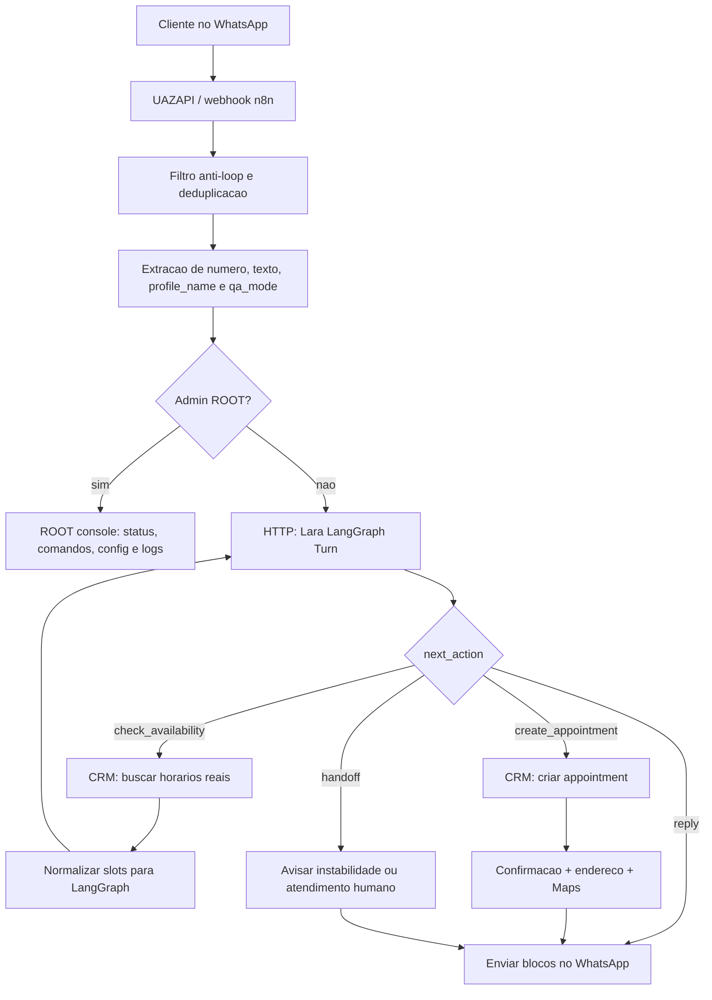
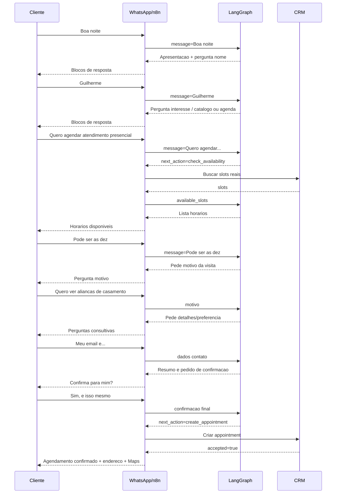

# ORIN Joias - Lara V9 WhatsApp SDR

## Resumo

Este repositorio documenta e versiona a automacao Lara V9 da ORIN Joias.

A Lara atende clientes pelo WhatsApp, qualifica a intencao, conduz o agendamento presencial, consulta horarios reais no CRM, cria appointment no CRM e envia o endereco correto somente depois da confirmacao do agendamento.

O objetivo principal desta versao e reduzir alucinacao e loop de atendimento separando responsabilidades:

- n8n orquestra WhatsApp, ROOT, CRM, envio e historico;
- LangGraph controla estado conversacional, memoria curta e decisao da proxima etapa;
- CRM e a fonte de verdade para horarios e agendamentos;
- ROOT e console/admin para comportamento e parametros da Lara, nao o motor principal de estado.

## Estado Atual

Branch de trabalho:

```text
codex/lara-v9-shadow-readiness
```

Workflow n8n atual:

```text
LARA V9 Shadow SDR
id: 7kXu17NYpsN8Yc65
```

Workflow antigo de referencia:

```text
ORION-WF-Bot-v7-LARA-SDR
id: 7SucjAi8zU69sQuT
```

LangGraph interno:

```text
http://lara-langgraph:8080/v1/lara/turn
health: http://lara-langgraph:8080/health
```

CRM agenda:

```text
Agenda primeiro, pipeline depois.
O agendamento precisa preencher nome, WhatsApp, data, horario, motivo e observacoes.
```

Endereco oficial:

```text
Av. Brasil, 1500 - Centro, Balneario Camboriu - SC, 88330-901
Google Maps: https://maps.app.goo.gl/geMC3hHsQqGfSnnm6
```

## Arquitetura Ponta A Ponta



## Responsabilidades Por Camada

### WhatsApp / UAZAPI

Responsavel por entregar mensagens recebidas e enviar blocos de resposta.

Regras:

- nunca processar mensagem enviada pelo proprio bot como se fosse cliente;
- preservar o numero real do cliente;
- separar mensagens em blocos curtos, como conversa humana;
- registrar erro de envio com telemetria honesta.

Telemetria esperada em envio:

```text
blocks_attempted
blocks_sent
send_success
send_errors
uazapi_token_present
```

### n8n

Responsavel por orquestrar o fluxo.

Faz:

- recebe webhook;
- detecta ROOT/admin;
- chama LangGraph;
- interpreta `next_action`;
- busca slots no CRM;
- cria appointment no CRM;
- envia mensagens WhatsApp;
- bloqueia side effects em `qa_mode`;
- guarda evidencias de execucao.

Nao deve fazer:

- decidir estado de conversa em prompt livre;
- inventar horario;
- confirmar appointment antes do CRM;
- guardar token em Set node ou texto puro;
- deixar dois workflows ativos respondendo o mesmo numero.

### LangGraph

Responsavel por estado e decisao conversacional.

Faz:

- isola memoria por `session_id`;
- confirma nome apenas quando o cliente informa;
- entende erro simples de digitacao;
- decide entre responder, buscar horario, criar appointment ou handoff;
- coleta motivo, detalhes, preferencia, e-mail e confirmacao do WhatsApp;
- monta `crm_note`;
- limpa sessao com `/rclear`.

Nao deve fazer:

- consultar CRM diretamente;
- enviar WhatsApp;
- usar nome do perfil como nome confirmado;
- inventar preco, estoque, produto ou horario;
- gravar saudacao, comando ou confirmacao curta como nome/motivo.

### CRM

Fonte de verdade para agenda.

Faz:

- retorna horarios disponiveis;
- cria appointment;
- registra lead/dados do cliente;
- alimenta a agenda visual e depois o pipeline de atendimento.

## Estados Conversacionais

Estados principais:

```text
inicio
identificacao
descoberta
agenda_slots
agenda_contexto
agenda_detalhes
agenda_tipo_joia
agenda_contato
agenda_resumo_confirmacao
agenda_criar
catalogo_info
encerrado
handoff
```

Fluxo feliz de agendamento:



## Contrato Da API LangGraph

Endpoint:

```http
POST /v1/lara/turn
```

Entrada minima:

```json
{
  "session_id": "wa:+5547999990000",
  "phone": "+5547999990000",
  "profile_name": "Nome do perfil, apenas informativo",
  "message": "Boa noite",
  "qa_mode": false,
  "state": {},
  "available_slots": []
}
```

Saida esperada:

```json
{
  "reply_blocks": [],
  "intent": "identification",
  "conversation_stage": "identificacao",
  "lead_temperature": "morno",
  "collected_context": {},
  "missing_fields": [],
  "next_action": "reply",
  "tool_payload": {},
  "crm_note": "",
  "state": {},
  "safety": {
    "used_confirmed_facts_only": true,
    "needs_human": false
  },
  "side_effects": {
    "send_whatsapp": true,
    "create_appointment": false,
    "update_crm": false
  }
}
```

Valores importantes de `next_action`:

```text
reply
check_availability
create_appointment
handoff
none
```

## Comandos Operacionais

### Limpar conversa do cliente

```text
/rclear
```

Comportamento esperado:

```text
Conversa reiniciada. Pode me chamar de novo quando quiser.
```

Depois disso, `Ola` precisa reiniciar em `identificacao`, sem contexto antigo.

### ROOT

ROOT e console/admin. Ele serve para diagnostico e ajustes de comportamento, mas nao deve substituir o controle de estado do LangGraph.

Comandos existentes/documentados:

```text
/status
/parametro
/persona [texto]
/tom [0-10]
/objetivo [texto]
/regra [texto]
/escrita [texto]
/corrigir [texto]
/exemplo entrada:X|saida:Y
/link nome|url|descricao
/newprompt [texto]
/clear
/reset
/exit
```

Regra de seguranca:

```text
Bug tecnico corrige no workflow/LangGraph.
Comportamento editorial corrige no ROOT.
```

## Como Rodar Localmente

```bash
python3 -m venv .venv-langgraph
. .venv-langgraph/bin/activate
pip install -r requirements-langgraph.txt
uvicorn lara_langgraph.service:app --host 0.0.0.0 --port 8080
```

Health:

```bash
curl http://127.0.0.1:8080/health
```

Turno de teste:

```bash
curl -s http://127.0.0.1:8080/v1/lara/turn \
  -H 'Content-Type: application/json' \
  -d '{"session_id":"wa:+550000000001","phone":"+550000000001","message":"Boa noite","state":{}}'
```

## Como Rodar Testes

```bash
.venv-langgraph/bin/python -m unittest tests/test_lara_langgraph.py tests/test_lara_service.py -v
```

QA n8n:

```bash
.venv-langgraph/bin/python scripts/lara_n8n_qa_journey.py --delay 14
```

Validacao de sintaxe antes de commit:

```bash
git diff --check
```

## Deploy No VPS

O servico `lara-langgraph` roda como container separado, na mesma rede do n8n.

Comando de health a partir do container n8n:

```bash
docker exec n8n-zcac-n8n-1 wget -qO- http://lara-langgraph:8080/health
```

Rebuild/recreate do LangGraph:

```bash
cd /docker/n8n-zcac/lara-src
docker build -f Dockerfile.langgraph -t n8n-zcac-lara-langgraph:latest .
cd /docker/n8n-zcac
docker compose up -d --no-deps --force-recreate lara-langgraph
```

## Versoes E Rollback

Historico detalhado:

```text
docs/VERSION_HISTORY.md
```

Tag recomendada para estado anterior a este handoff:

```text
lara-v9-pre-rclear-20260723
```

Rollback operacional recomendado:

1. Identificar a causa da falha pela execution id do n8n.
2. Se for LangGraph, voltar imagem/container para o commit/tag anterior.
3. Se for workflow n8n, restaurar backup em `backups/`.
4. Validar health do LangGraph.
5. Rodar conversa de smoke no WhatsApp.

Nao fazer rollback cego se o problema for apenas estado contaminado. Primeiro testar `/rclear` e conferir o arquivo de estado persistido.

## Evidencias Importantes

Relatorio principal:

```text
qa/lara_v9_goal_report_20260720.md
```

Execucoes citadas:

```text
4206 - confirmacao final "Sim e isso mesmo" tratada errado antes do patch
4209 - memoria antiga contaminou nova mensagem
4210 - contexto antigo ainda preso
4211 - /rclear entrou como texto comum antes da correcao
```

Smoke remoto validado depois do patch:

```text
/rclear -> intent=session_clear, conversation_stage=inicio
Ola     -> intent=identification, conversation_stage=identificacao
```

## Mapa Completo Para Handoff

O mapa completo do fluxo esta em:

```text
docs/LARA_FULL_FLOW_MAP.md
```

Esse arquivo documenta:

- entrada WhatsApp/UAZAPI;
- deduplicacao e anti-loop;
- tratamento de texto;
- tratamento de audio, imagem, video e documentos;
- extracao de CSV, PDF, XLSX, JSON, XML, HTML, RTF, ICS e texto;
- buffer de mensagens;
- ROOT console;
- LangGraph;
- memoria persistida;
- CRM;
- envio WhatsApp;
- QA mode;
- scripts;
- knowledge/catalogo;
- backups;
- diagnostico por execution id;
- erros reais ja corrigidos;
- criterio de pronto.

## Ultimas Atualizacoes

Este bloco registra exatamente o que foi feito na ultima rodada para outro dev
entender o estado atual sem depender do historico do chat.

### Conversa E Estado

- A Lara V9 foi reorganizada para conduzir o atendimento por estados, nao por
  prompt solto:
  - `inicio`;
  - `identificacao`;
  - `descoberta`;
  - `agenda_slots`;
  - `agenda_contexto`;
  - `agenda_detalhes`;
  - `agenda_contato`;
  - `agenda_resumo_confirmacao`;
  - `agenda_criar`;
  - `pos_agendamento`;
  - `handoff`.
- Saudacao curta, como `Ola`, `Oi`, `Bom dia` ou `Boa noite`, deve abrir o
  atendimento e pedir o nome.
- Nome so e confirmado quando o cliente informa o nome na conversa.
- `profile_name` do WhatsApp e apenas informativo, nao pode virar nome
  confirmado automaticamente.
- Depois do nome confirmado, a Lara deve perguntar o que o cliente busca e
  oferecer catalogo ou atendimento presencial.
- A Lara nao deve pedir o nome novamente depois que o cliente ja informou.
- A Lara nao deve reiniciar a saudacao no meio da conversa quando o cliente pede
  agendamento.

### Agendamento

- O fluxo de agendamento correto ficou definido assim:
  - cliente pede atendimento presencial;
  - Lara solicita horarios reais ao CRM;
  - n8n consulta slots reais;
  - Lara apresenta somente horarios recebidos do CRM;
  - cliente escolhe horario;
  - Lara coleta motivo da visita;
  - Lara coleta detalhes que ajudem o atendente;
  - Lara coleta e-mail/contato quando necessario;
  - Lara resume data, horario, motivo e detalhes;
  - cliente confirma;
  - n8n cria appointment no CRM;
  - Lara confirma o agendamento e so entao envia endereco e Google Maps.
- Endereco oficial validado:

```text
Av. Brasil, 1500 - Centro, Balneario Camboriu - SC, 88330-901
Google Maps: https://maps.app.goo.gl/geMC3hHsQqGfSnnm6
```

- O endereco so deve aparecer antes do fim se o cliente pedir localizacao.
- A agenda do CRM continua sendo a fonte de verdade. A Lara nao pode inventar
  horario.

### LangGraph

- Foi criado o servico `lara-langgraph` para centralizar estado e decisao da
  conversa.
- Endpoint interno:

```text
POST http://lara-langgraph:8080/v1/lara/turn
GET  http://lara-langgraph:8080/health
```

- O servico roda em container separado do n8n, mas na mesma rede Docker.
- O `session_id` isola a memoria por conversa.
- `/rclear`, `/clear`, `/limpar` e comandos equivalentes devem limpar a sessao
  antes de qualquer interpretacao de texto.
- Foi corrigido o caso em que `Sim e isso mesmo` entrava como novo detalhe em
  vez de confirmar o resumo final.
- Foi corrigido o caso de saudacao duplicada depois de reset.

### n8n

- O workflow V9 atual e `LARA V9 Shadow SDR`, id `7kXu17NYpsN8Yc65`.
- O workflow antigo de referencia e `ORION-WF-Bot-v7-LARA-SDR`, id
  `7SucjAi8zU69sQuT`.
- A chamada ao LangGraph deve retornar um contrato com `reply_blocks`,
  `intent`, `conversation_stage` e `next_action`.
- `next_action=check_availability` deve chamar o CRM para buscar horarios.
- `next_action=create_appointment` deve criar o appointment no CRM.
- `Code: Parse Agent Output` e o ponto critico para normalizar a resposta do
  LangGraph antes de decidir o proximo ramo.
- Dois workflows nao podem ficar ativos respondendo o mesmo numero de WhatsApp.

### CRM

- O CRM precisa receber no agendamento:
  - nome do contato;
  - WhatsApp;
  - data;
  - horario;
  - motivo da visita;
  - observacoes com os detalhes coletados.
- O funil correto e agenda primeiro, pipeline depois.
- Se o CRM nao retornar slots, a Lara deve informar indisponibilidade/controlar
  handoff, nao inventar horarios.

### Midias E Arquivos

- A documentacao do fluxo completo registra tratamento para texto, audio,
  imagem, video e documentos.
- O fluxo esperado e baixar a midia, identificar o tipo e transformar em texto
  antes de chamar a Lara, quando o tipo for suportado.
- Tipos documentados: CSV, PDF, XLSX/ODS, JSON, XML, HTML, RTF, ICS e texto.
- Arquivo nao suportado deve gerar resposta controlada, sem invencao de
  conteudo.

### Deploy E Risco Atual

- A imagem `n8n-zcac-lara-langgraph:latest` e local do VPS.
- Se a Hostinger tentar puxar essa imagem de registry publico, o deploy falha.
- O `docker-compose.yml` precisa manter `build:` apontando para o codigo local
  ou a imagem precisa ser publicada em registry privado.
- Depois do backup/restauracao do VPS, foi verificado que:
  - o workflow V9 seguia ativo;
  - o LangGraph respondia `/health`;
  - o codigo critico do runtime estava preservado;
  - o source remoto ainda podia estar defasado em relacao ao GitHub;
  - era necessario validar a jornada real novamente no WhatsApp.
