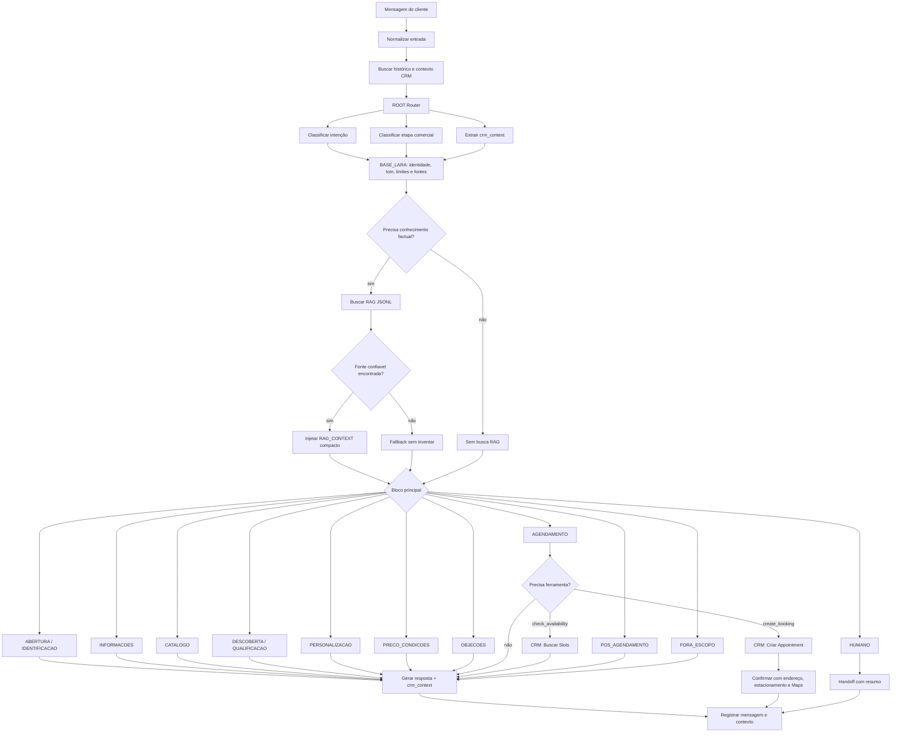

# Plano V8 — Lara Por Blocos, Roteador E Contexto Para CRM

## Objetivo

Transformar a Lara de um prompt geral em uma automação com prompt base, roteador de intenção, blocos comerciais e captura estruturada de dados para o atendente humano.

Complemento arquitetural:

- A arquitetura V8 define comportamento, roteamento e blocos.
- A camada RAG JSONL define conhecimento factual consultável.
- A documentação da camada RAG fica em `docs/LARA_RAG_JSONL_ARCHITECTURE.md`.
- Como ainda não existe catálogo online, a primeira implementação usa `knowledge/*.jsonl`; `catalogo/*.jsonl` fica para fase futura.

Meta operacional:

- responder de forma mais humana;
- reduzir alucinação;
- conduzir para agendamento ou especialista;
- preencher o agendamento com contexto útil;
- deixar a arquitetura pronta para futuro painel visual no CRM.

## Princípio De Arquitetura

Não criar um nó n8n para cada bloco nesta fase.

Primeiro criar uma estrutura única de configuração:

```json
{
  "base_lara": "...",
  "router": "...",
  "blocks": {
    "ABERTURA": "...",
    "INFORMACOES": "...",
    "DESCOBERTA": "...",
    "AGENDAMENTO": "..."
  },
  "crm_context_schema": {
    "interesse": "",
    "material": "",
    "ocasiao": "",
    "orcamento": "",
    "urgencia": ""
  }
}
```

O n8n injeta essa estrutura no contexto da Lara. A Lara escolhe o bloco certo e responde dentro do contrato técnico.

`base_lara` é o antigo Prompt Master reorganizado. Ele não desaparece e não vira um bloco comum. Ele é a camada global que vale para qualquer conversa.

No fluxo ativo, a Lara recebe uma `BASE_LARA EFETIVA`, montada com:

- `root_blocks.base_lara`;
- `custom_prompt`;
- `persona_extra`;
- `tom`;
- `objetivos`;
- `rules`;
- `write_rules`;
- `corrections`;
- `examples`;
- `links`;
- parâmetros globais adicionais do ROOT.

Isso significa que comandos como `/persona`, `/tom`, `/objetivo`, `/regra`, `/escrita`, `/corrigir`, `/exemplo` e `/link` são ajustes da base global, não comandos paralelos soltos.

Essa base efetiva é a primeira camada que a Lara deve ler antes do roteador e antes dos blocos situacionais:

- identidade da Lara;
- tom e postura;
- objetivo comercial;
- limites do que não pode inventar;
- fontes oficiais;
- regras globais de CRM, agenda e segurança.

Regra de corte:

- se vale para toda conversa, fica em `BASE_LARA`;
- se vale só para uma situação, vai para um bloco;
- se é fato de produto, catálogo, FAQ, política, endereço ou link, vai para RAG JSONL;
- se precisa de ferramenta real, vira ação/nó do n8n.

Nós separados só devem existir quando houver ferramenta real:

- consultar agenda;
- criar agendamento;
- registrar CRM;
- handoff humano;
- teste/simulação.

## Fluxograma V8



## Blocos Comerciais V1

### `BASE_LARA`

Origem:

- antigo Prompt Master;
- regras globais já configuradas no ROOT;
- links oficiais;
- limites técnicos de agenda e CRM.

Função:

- definir quem é a Lara;
- manter tom premium, humano e consultivo;
- impedir alucinação;
- dizer que agenda, preço, estoque e condições dependem de fonte confirmada;
- preservar objetivo de qualificar e conduzir para atendimento/agendamento.

Não deve conter:

- roteiro específico de saudação;
- resposta de preço;
- fluxo de catálogo;
- passo a passo de agendamento;
- texto de pós-agendamento;
- tratamento de objeção.

Esses itens vão para blocos.

### `ROUTER`

Função:

- identificar intenção principal;
- identificar etapa comercial;
- selecionar bloco;
- extrair dados para CRM;
- decidir próxima ação.

Saída esperada:

- `intent`;
- `lead_temperature`;
- `conversation_stage`;
- `selected_blocks`;
- `collected_context`;
- `missing_fields`;
- `next_action`.

### `ABERTURA`

Quando usar:

- primeira mensagem;
- saudação simples;
- cliente sem contexto.

Objetivo:

- apresentar Lara;
- perguntar nome se ainda não estiver confirmado;
- oferecer caminhos claros.

### `IDENTIFICACAO`

Quando usar:

- nome ausente;
- nome do WhatsApp não confirmado;
- cliente respondeu só nome.

Objetivo:

- confirmar nome real;
- evitar usar nome de outro contato;
- salvar nome para contexto.

### `INFORMACOES`

Quando usar:

- endereço;
- localização;
- Google Maps;
- estacionamento;
- horário de funcionamento;
- atendimento online;
- ausência de loja online;
- cliente quer saber como funciona.

Objetivo:

- responder factual sem inventar;
- usar links oficiais;
- conduzir para visita ou especialista.

Regra:

- após agendamento confirmado, enviar endereço, estacionamento e Google Maps.
- antes da confirmação, só enviar localização se o cliente pedir.

### `CATALOGO`

Quando usar:

- cliente quer ver peças, site, catálogo, modelos ou inspirações.

Objetivo:

- consultar `knowledge/produtos_genericos.jsonl` na fase atual;
- explicar que ainda não existe catálogo online com link direto de produto;
- no futuro, consultar `catalogo/*.jsonl` antes de responder sobre produto específico;
- no futuro, enviar produto, resumo e link quando houver correspondência confiável;
- se não houver loja online funcional ou produto confiável, explicar sem travar a venda;
- conduzir para atendimento consultivo.

Regra:

- não prometer link de produto na fase atual;
- não inventar produto, preço, estoque, material ou disponibilidade;
- não mandar o catálogo inteiro para a IA;
- injetar só 3 a 5 resultados relevantes no `RAG_CONTEXT`.

### `DESCOBERTA`

Quando usar:

- cliente demonstra interesse, mas ainda não está claro o que deseja.

Objetivo:

- descobrir tipo de peça;
- ocasião;
- estilo;
- prazo;
- região;
- se é presente, casamento, noivado, uso pessoal ou personalização.

Técnica:

- perguntas consultivas curtas;
- uma pergunta por vez quando possível.

### `QUALIFICACAO`

Quando usar:

- cliente mostra intenção comercial.

Objetivo:

- medir temperatura do lead;
- entender se deve ir para catálogo, agendamento ou humano.

Campos:

- interesse;
- peça;
- ocasião;
- urgência;
- orçamento quando surgir naturalmente;
- cidade/região;
- intenção de visita.

### `PERSONALIZACAO`

Quando usar:

- cliente fala em joia sob medida, gravação, design, material, pedra, estilo.

Objetivo:

- entender ideia;
- coletar referência;
- direcionar para especialista/agendamento.

### `PRECO_CONDICOES`

Quando usar:

- preço;
- orçamento;
- desconto;
- prazo;
- forma de pagamento;
- garantia;
- pronta entrega.

Objetivo:

- não inventar valor;
- explicar que depende de material/design/pedra;
- pedir contexto mínimo ou encaminhar especialista.

### `OBJECOES`

Quando usar:

- cliente está inseguro;
- achou caro;
- quer comparar;
- quer pensar;
- diz que está só olhando.

Objetivo:

- reduzir pressão;
- manter relacionamento;
- oferecer Instagram/catálogo ou conversa com especialista.

### `AGENDAMENTO`

Quando usar:

- cliente quer visitar;
- aceitou horário;
- pediu disponibilidade.

Objetivo:

- consultar CRM;
- apresentar só horários retornados;
- coletar dados obrigatórios;
- criar appointment.

Campos mínimos para criar:

- nome completo;
- WhatsApp;
- data/hora;
- motivo real da visita;
- contexto comercial resumido.

### `POS_AGENDAMENTO`

Quando usar:

- create_booking retornou sucesso.

Objetivo:

- confirmar agendamento;
- enviar data, horário, endereço, estacionamento e Google Maps;
- perguntar se pode ajudar em mais alguma coisa.

### `HUMANO`

Quando usar:

- pedido complexo;
- reclamação;
- erro técnico;
- cliente pede atendente;
- Lara não tem fonte segura.

Objetivo:

- encaminhar para especialista com resumo.

### `FORA_ESCOPO`

Quando usar:

- assunto sem relação com ORIN Joias.

Objetivo:

- redirecionar sem inventar.

## Contexto Que Deve Ir Para O CRM

Hoje o n8n envia:

```json
{
  "customer_name": "...",
  "visit_reason": "...",
  "original_notes": "..."
}
```

Isso é fraco para o atendente.

Novo contrato recomendado:

```json
{
  "customer_name": "Nome confirmado",
  "whatsapp_number": "+5547...",
  "intent": "agendamento|catalogo|personalizacao|preco|informacoes|humano",
  "lead_temperature": "frio|morno|quente",
  "conversation_stage": "descoberta|qualificacao|agendamento|pos_agendamento",
  "interest": "alianças, anel de noivado, presente, joia personalizada...",
  "piece_type": "anel|aliança|colar|brinco|pulseira|indefinido",
  "occasion": "casamento|noivado|presente|uso pessoal|formatura|indefinido",
  "material": "ouro 17k, ouro amarelo, ouro branco, prata, indefinido",
  "style": "clássico, moderno, delicado, robusto, minimalista...",
  "budget": "informado pelo cliente ou não informado",
  "urgency": "data/prazo citado ou sem prazo",
  "visit_reason": "motivo real da visita em frase curta",
  "summary_for_human": "Resumo objetivo para o atendente",
  "questions_answered": ["..."],
  "missing_info": ["..."],
  "recommended_next_step": "mostrar modelos, orçamento, confirmar medida, apresentar alianças..."
}
```

Compatibilidade com CRM atual:

- `appointments.ai_context` já existe como JSONB.
- `AiContextCard` hoje exibe só: `interesse`, `material`, `ocasiao`, `orcamento`, `urgencia`.
- Primeiro passo pode preencher esses cinco campos no formato atual.
- Segundo passo deve expandir o card para exibir o contrato completo.

## Mudanças Planejadas No n8n

### Fase 1 — Contrato e prompt, sem mexer em nós críticos

- Criar `ROOT_BLOCKS` dentro de `LARA_ROOT_CONFIG`.
- Atualizar `ROOT: Injetar Regras` para injetar blocos.
- Atualizar prompt técnico do AI Agent para exigir `crm_context`.
- Não alterar CRM ainda.

### Fase 2 — Parser e payload de agendamento

- Atualizar `Code: Parse Agent Output` para validar `crm_context`.
- Não aceitar `notes` genérico como motivo real.
- Enriquecer `CRM: Criar Appointment` com:
  - `ai_context.interesse`;
  - `ai_context.material`;
  - `ai_context.ocasiao`;
  - `ai_context.orcamento`;
  - `ai_context.urgencia`;
  - `ai_context.summary_for_human`;
  - `ai_context.recommended_next_step`.

### Fase 3 — CRM visual

- Expandir `AiContextCard`.
- Mostrar resumo para atendente no detalhe do agendamento.
- Mostrar contexto também na aba de agendamentos do lead.

### Fase 4 — Teste antes de produção

- Criar `/teste [mensagem]` ou workflow de simulação.
- Criar cenários fixos:
  - saudação;
  - catálogo;
  - endereço;
  - loja online ausente;
  - aliança;
  - preço;
  - personalização;
  - agendamento;
  - confirmação de horário;
  - pós-agendamento;
  - fora de escopo.

### Fase 5 — RAG JSONL sem catálogo online

- Criar base factual em `knowledge/*.jsonl`.
- Criar `knowledge/produtos_genericos.jsonl` para categorias sem link.
- Criar `catalogo/README.md` marcando produto com link como futuro.
- Criar `knowledge/*.jsonl` para FAQ, loja, links e políticas.
- Implementar buscador interno antes do AI Agent.
- Injetar `RAG_CONTEXT` compacto no prompt.
- Registrar `catalog_status` no `crm_context` quando o cliente pedir produto específico sem catálogo online.
- Criar comandos ROOT planejados: `/rag status`, `/rag produto`, `/rag log`, `/rag sync`.

### Fase 6 — Catálogo online futuro

- Criar espelho do site em `catalogo/*.jsonl`.
- Permitir link de produto somente com fonte oficial.
- Registrar `catalog_matches` no `crm_context` quando houver produto relevante.

## Riscos

- Blocos demais podem piorar se não houver roteador claro.
- Se o n8n virar um nó por bloco, a manutenção fica pesada.
- Prompt modular sem teste pode criar regressão silenciosa.
- CRM pode estar recebendo `ai_context`, mas a UI atual mostra poucos campos.
- Se a IA ler o JSONL inteiro, o custo sobe e a precisão cai.
- Se a busca do catálogo acontecer durante a conversa em tempo real contra o site, o atendimento pode ficar lento e frágil.
- Se a Lara prometer link de produto antes de existir catálogo online, a automação volta a alucinar.

## Recomendação De Execução

1. Criar o mapa de blocos no ROOT, sem painel.
2. Enriquecer `crm_context` no JSON da Lara.
3. Ajustar payload do appointment.
4. Expandir o card do CRM.
5. Criar `/teste`.
6. Criar RAG JSONL factual sem catálogo online.
7. Criar buscador interno.
8. Só depois desenhar painel visual no CRM.
9. Produto com link fica para fase futura.
