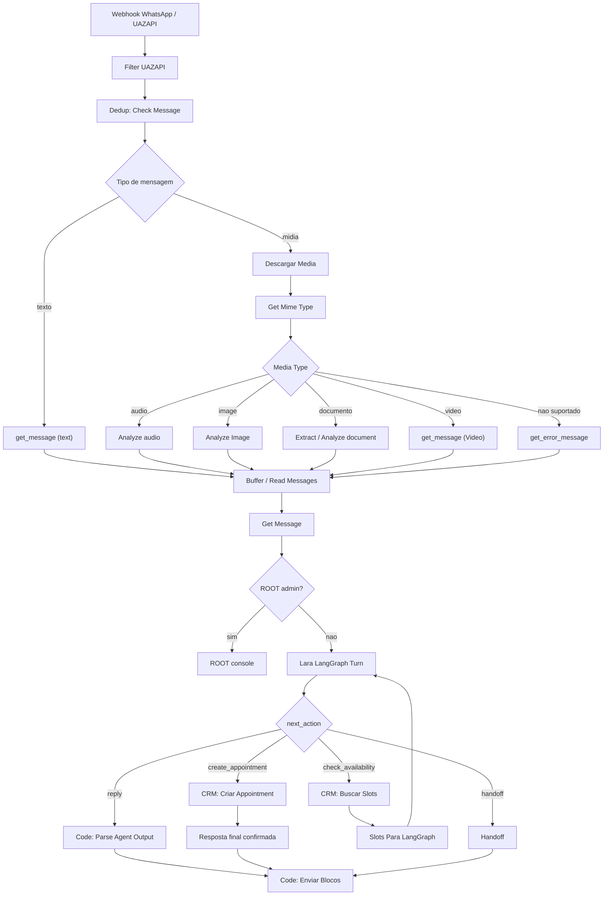

# Lara V9 - Mapa Completo Do Fluxo

## Objetivo Deste Documento

Este arquivo e o mapa operacional completo para o proximo dev assumir a Lara V9 sem depender do historico do chat.

Ele descreve:

- o que o fluxo faz ponta a ponta;
- onde cada responsabilidade fica;
- como mensagens, midias, arquivos, ROOT, LangGraph, CRM e WhatsApp se conectam;
- quais partes sao fonte de verdade;
- como testar sem quebrar producao;
- onde olhar quando der erro.

## Visao Geral

A Lara V9 e um autoatendimento SDR para WhatsApp da ORIN Joias.

O objetivo de negocio e conduzir o cliente para atendimento presencial com contexto suficiente para o atendente humano vender melhor.

O fluxo precisa:

- atender com tom consultivo e sofisticado;
- perguntar nome no inicio, sem confiar em nome de perfil;
- entender intencao do cliente;
- oferecer catalogo ou agendamento presencial;
- buscar horarios reais no CRM;
- coletar motivo da visita;
- coletar detalhes que ajudem o atendente;
- coletar e-mail e confirmar WhatsApp quando necessario;
- resumir antes de criar appointment;
- criar appointment real no CRM somente depois da confirmacao;
- enviar endereco e Google Maps somente apos confirmacao do agendamento ou quando o cliente pedir localizacao;
- permitir handoff humano;
- permitir ROOT/admin sem misturar com cliente.

## Componentes

| Componente | Papel |
|---|---|
| WhatsApp/UAZAPI | Recebe e envia mensagens |
| n8n | Orquestra entrada, ROOT, LangGraph, CRM, envio e QA |
| LangGraph | Controla estado da conversa, memoria e proxima acao |
| CRM Orion | Fonte de verdade para horarios e appointments |
| Redis/n8n memory | Buffer, dedup, historico e apoio operacional |
| ROOT | Console admin para comportamento, status e comandos |
| knowledge/*.jsonl | Fonte factual compacta para dados estaveis |
| catalogo/ | Reserva futura para catalogo oficial |

## Fluxo Macro



## Entrada WhatsApp

Entrada esperada:

- numero do cliente;
- nome de perfil apenas informativo;
- id da mensagem;
- timestamp;
- tipo da mensagem;
- texto ou midia;
- token do provedor quando aplicavel.

Regras:

- `profile_name` nunca vira `confirmed_name`;
- mensagem propria do bot nao pode voltar para o fluxo como mensagem de cliente;
- cada mensagem deve ter deduplicacao por id;
- `qa_mode=true` precisa bloquear envio real e side effects reais.

## Deduplicacao E Anti-loop

Objetivo:

- evitar que a Lara responda a mesma mensagem duas vezes;
- evitar loop quando o provedor devolve mensagem enviada pelo proprio bot;
- impedir duplicidade em retry de webhook.

Nos relacionados:

- `Filter UAZAPI`;
- `Dedup: Check Message`;
- buffers Redis;
- filtros de `fromMe`, message id e numero.

Falha comum:

```text
Cliente manda uma mensagem e recebe duas respostas iguais ou respostas de dois fluxos.
```

Diagnostico:

1. conferir se ha mais de um workflow ativo;
2. conferir `fromMe`;
3. conferir chave de dedup;
4. conferir se UAZAPI reenviou o mesmo id.

## Tratamento De Texto

Mensagem de texto passa por:

1. extracao do corpo textual;
2. normalizacao de payload;
3. buffer para juntar mensagens rapidas;
4. `Get Message`;
5. ROOT ou LangGraph.

Regra:

- texto curto como `oi`, `ola`, `bom dia`, `boa noite` e `tudo bem` nao pode virar nome;
- horario isolado so pode ser interpretado como horario se ja houver slots pendentes;
- confirmacao curta so pode confirmar algo se o estado estiver esperando confirmacao.

## Tratamento De Midia E Arquivos

O fluxo possui suporte para midias e arquivos antes de enviar o texto final para a Lara.

### Download De Midia

No principal:

```text
Descargar Media
```

Responsabilidade:

- baixar a midia do provedor;
- preservar caption, fileName, mimetype e binario/base64;
- entregar para classificacao.

### Classificacao MIME

No principal:

```text
Get Mime Type
```

Categorias reconhecidas:

- `image`;
- `audio`;
- `video`;
- `pdf`;
- `spreadsheet`;
- `document`;
- `text`;
- `csv`;
- `html`;
- `rtf`;
- `json`;
- `xml`;
- `ics`;
- `other`.

Regra:

- tipo desconhecido deve gerar mensagem de erro controlada, nao deve quebrar o fluxo;
- arquivo nao suportado nao pode virar prompt solto para a IA inventar conteudo.

### Audio

Nos relacionados:

```text
Analyze audio
get_message (Audio)
```

Responsabilidade:

- transcrever audio;
- transformar a transcricao em texto de cliente;
- seguir para a mesma rota de `Get Message`.

Falha comum:

```text
Audio chega, mas a Lara nao responde ou responde sem contexto.
```

Diagnostico:

1. verificar se o download da midia retornou binario;
2. verificar `mimetype`;
3. verificar retorno de `Analyze audio`;
4. verificar `get_message (Audio)`.

### Imagem

Nos relacionados:

```text
Analyze Image
get_message (Image)
```

Responsabilidade:

- extrair descricao ou texto relevante da imagem;
- combinar caption com resultado da analise;
- entregar uma mensagem textual para a Lara.

Regra:

- a Lara pode interpretar uma imagem como contexto do atendimento;
- a Lara nao deve prometer preco, estoque ou disponibilidade da peca mostrada sem fonte oficial.

### Documentos E Arquivos Estruturados

Nos de extracao:

```text
Extract from CSV
Extract from ICS
Extract from JSON
Extract from ODS
Extract from PDF
Extract from RTF
Extract from File
Extract from XLSX
Extract from XML
Normalize text file
Analyze document
get_message (File message)
```

Responsabilidade:

- extrair texto/dados relevantes;
- normalizar conteudo;
- anexar caption e metadados do arquivo;
- enviar texto consolidado para a Lara.

Regra:

- se o arquivo for grande demais, resumir de forma segura;
- se a extracao falhar, responder com erro controlado;
- nao expor conteudo sensivel em log publico;
- nao usar arquivo de cliente como fonte permanente sem decisao explicita.

### Video

No relacionado:

```text
get_message (Video)
```

Responsabilidade:

- tratar caption/metadados;
- quando nao houver analise completa de video, pedir esclarecimento ao cliente.

## Buffer De Mensagens

Objetivo:

- juntar mensagens muito rapidas do mesmo cliente;
- reduzir respostas quebradas fora de ordem;
- evitar que a Lara responda antes do cliente terminar de escrever.

Nos relacionados:

- `Push Media to Buffer`;
- `Normalize MediaGroup Buffer`;
- `Wait For User Other Fast Message`;
- `Read Messages`;
- Redis buffers.

Regra:

- buffer deve preservar ordem;
- buffer deve separar sessoes por numero;
- buffer de QA deve usar numero fake isolado.

## ROOT Console

ROOT e o console/admin da Lara.

Ele serve para:

- consultar status;
- listar parametros;
- ajustar comportamento;
- registrar links;
- consultar log;
- limpar sessao/admin;
- assumir/devolver atendimento quando implementado.

ROOT nao e o motor de decisao da conversa.

Comandos/documentos relacionados:

- `docs/LARA_ROOT_ARCHITECTURE.md`;
- `/status`;
- `/parametro`;
- `/persona`;
- `/tom`;
- `/objetivo`;
- `/regra`;
- `/escrita`;
- `/corrigir`;
- `/exemplo`;
- `/link`;
- `/newprompt`;
- `/clear`;
- `/reset`;
- `/exit`.

Regra:

```text
Se o bug for estado, parser, slot, CRM ou envio, corrija no fluxo/LangGraph.
Se for tom, escrita ou comportamento editorial, ajuste no ROOT.
```

## LangGraph

Arquivos:

```text
lara_langgraph/graph.py
lara_langgraph/service.py
lara_langgraph/root_console.py
tests/test_lara_langgraph.py
tests/test_lara_service.py
```

Responsabilidades:

- estado por `session_id`;
- memoria curta persistida;
- identificacao de nome;
- descoberta de interesse;
- decisao de agendamento;
- reconhecimento de horario escolhido;
- coleta de motivo;
- coleta de detalhes consultivos;
- coleta de preferencia pronta/personalizada;
- coleta de e-mail;
- confirmacao do WhatsApp;
- resumo final;
- autorizacao de `create_appointment`;
- handoff;
- reset com `/rclear`.

Estados:

```text
inicio
identificacao
descoberta
agenda_slots
agenda_contexto
agenda_detalhes
agenda_tipo_joia
agenda_contato
agenda_resumo_confirmacao
agenda_criar
catalogo_info
encerrado
handoff
```

Contrato:

```http
POST /v1/lara/turn
```

Entrada:

```json
{
  "session_id": "wa:+5547999990000",
  "phone": "+5547999990000",
  "profile_name": "informativo",
  "message": "Boa noite",
  "qa_mode": false,
  "state": {},
  "available_slots": []
}
```

Saida:

```json
{
  "reply_blocks": [],
  "intent": "appointment",
  "conversation_stage": "agenda_slots",
  "next_action": "check_availability",
  "tool_payload": {},
  "crm_note": "",
  "state": {},
  "side_effects": {}
}
```

## Memoria

Fonte atual:

```text
LARA_STATE_FILE=/data/lara_sessions.json
```

Volume:

```text
lara_langgraph_data:/data
```

Regras:

- memoria e isolada por `session_id`;
- `session_id` deve ser derivado do numero/conversa;
- nao usar nome de perfil como nome confirmado;
- `/rclear` deve limpar estado antes de qualquer outra rota;
- estado contaminado nao exige rollback de codigo, exige limpeza de sessao.

Risco tecnico:

- arquivo JSON resolve persistencia simples, mas nao e o ideal para alta concorrencia;
- proxima evolucao recomendada: Postgres ou Redis duravel como checkpointer.

## CRM

O CRM e a fonte de verdade para:

- slots disponiveis;
- appointment criado;
- lead;
- agenda visual;
- pipeline posterior.

Endpoints usados pelo fluxo:

```text
available-slots
create-appointment
```

Campos esperados ao criar appointment:

- nome;
- WhatsApp;
- data;
- horario;
- e-mail, quando coletado;
- motivo;
- interesse;
- preferencia;
- observacoes;
- `ai_context`.

Regra:

- nao criar appointment antes de motivo, contato e confirmacao final;
- nao inventar horario;
- agenda primeiro, pipeline depois.

## Envio WhatsApp

Nos principais:

```text
Code: Enviar Pre-Blocos
Code: Enviar Blocos
Handoff: Msg ao Cliente
ROOT: Enviar Resposta Admin
ROOT: Enviar Resposta Livre
```

Regra:

- mensagem deve sair em blocos;
- atraso entre blocos deve simular atendimento humano;
- erro de envio deve aparecer em telemetria;
- `qa_mode=true` nao pode enviar WhatsApp real.

Telemetria:

```text
blocks_attempted
blocks_sent
send_success
send_errors
uazapi_token_present
```

## QA Mode

`qa_mode` existe para testar sem side effects.

Em QA:

- nao envia WhatsApp real;
- nao cria appointment real;
- nao atualiza lead real;
- nao salva config ROOT real;
- usa numero fake isolado;
- registra output para comparacao.

Arquivos:

```text
qa/lara_qa_journeys.json
qa/lara_journey_actual_outputs.json
qa/lara_journey_report.json
scripts/lara_n8n_qa_journey.py
```

## Scripts

| Script | Papel |
|---|---|
| `scripts/lara_n8n_qa_journey.py` | Roda jornadas QA no webhook n8n |
| `scripts/lara_langgraph_smoke.py` | Smoke direto no LangGraph |
| `scripts/lara_plan_status.js` | Apoio para status/plano |
| `scripts/lara_publish_workflow.py` | Apoio operacional de publicacao |
| `scripts/patch_lara_*` | Historico local de patches aplicados/experimentais |
| `scripts/update_lara_qa_*` | Atualizacao de cenarios QA |

Regra:

- scripts de patch antigos nao devem ser rodados cegamente;
- antes de rodar script contra n8n remoto, conferir side effects e backup;
- scripts que usam API key devem receber segredo por variavel de ambiente.

## Knowledge E Catalogo

Arquivos:

```text
knowledge/loja.jsonl
knowledge/atendimento.jsonl
knowledge/links.jsonl
knowledge/politicas.jsonl
knowledge/faq.jsonl
knowledge/produtos_genericos.jsonl
catalogo/README.md
```

Uso:

- knowledge guarda fatos estaveis e compactos;
- catalogo real ainda e futuro;
- sem catalogo oficial, a Lara deve conduzir para especialista ou agendamento.

Proibido:

- inventar preco;
- inventar estoque;
- inventar link de produto;
- prometer disponibilidade.

## Backups

Pasta:

```text
backups/
```

Contem exports de workflow antes/depois de patches.

Importante:

- muitos backups e dumps locais podem conter dados sensiveis ou API key em headers;
- nao commitar dump bruto sem scan;
- usar backups para rollback de n8n, nao para fonte de prompt.

## Diagnostico De Erro

Sempre comece pela execution id do n8n.

Nos para abrir:

```text
Get Message
ROOT: Detectar Admin
ROOT: Parser de Comando
Lara LangGraph Turn
Code: Parse Agent Output
Code: Enviar Pre-Blocos
Switch: Qual Action?
CRM: Buscar Slots
Code: Slots Para LangGraph
CRM: Criar Appointment
Code: Enviar Blocos
```

Perguntas de diagnostico:

1. A mensagem chegou no n8n?
2. O numero esta certo?
3. Veio como texto, audio, imagem ou arquivo?
4. A midia foi convertida em texto corretamente?
5. ROOT interceptou por engano?
6. LangGraph recebeu `session_id` correto?
7. O estado anterior estava contaminado?
8. `next_action` esta correto?
9. O parser traduziu a action corretamente?
10. O switch caiu no caminho certo?
11. O CRM retornou dado real?
12. O appointment foi criado?
13. O envio WhatsApp deu `send_success=true`?

## Erros Reais Ja Encontrados

### Confirmacao final virava detalhe

Entrada:

```text
Sim e isso mesmo
```

Falha:

```text
Lara tratava como novo detalhe, nao como confirmacao.
```

Correção:

- ampliar reconhecimento de confirmacao em `lara_langgraph/graph.py`;
- teste: `test_final_confirmation_phrase_does_not_overwrite_visit_reason`.

### `/rclear` contaminava contexto

Entrada:

```text
/rclear
```

Falha:

```text
Comando entrava como texto comum e virava detalhe do atendimento.
```

Correção:

- rota deterministica de clear antes das etapas conversacionais;
- teste: `test_rclear_resets_session_instead_of_becoming_appointment_reason`.

### Saudacao duplicada

Falha:

```text
Ola, tudo bem. Tudo bem?
```

Correção:

- tratamento especifico de cumprimento generico;
- teste: `test_generic_hello_does_not_duplicate_tudo_bem`.

### Horario extraido da data

Falha:

```text
2026-07-21 gerava horario 07:00 indevido.
```

Correção:

- parser de slots ajustado para extrair somente slots reais retornados pelo CRM.

## Criterio De Pronto

Nao declarar 100% ate passar:

- uma unica workflow ativa respondendo o numero;
- health LangGraph OK de dentro do n8n;
- `/rclear` limpa a sessao;
- saudacao inicia identificacao;
- nome nao e repetido nem pedido de novo;
- pedido de agendamento chama CRM;
- horarios exibidos vem do CRM;
- escolha de horario nao cria appointment ainda;
- motivo e detalhes sao coletados;
- e-mail/WhatsApp sao confirmados;
- resumo final e confirmado;
- appointment e criado no CRM;
- endereco correto e enviado no final;
- WhatsApp real confirma entrega;
- issue `ORION-CRM#14` recebe evidencias.

## Regra Final

Nao mexa no prompt antes de provar onde o fluxo quebrou.

Se nao ha execution id, nao ha diagnostico.

Se nao ha teste real ou QA documentado, nao ha pronto.
