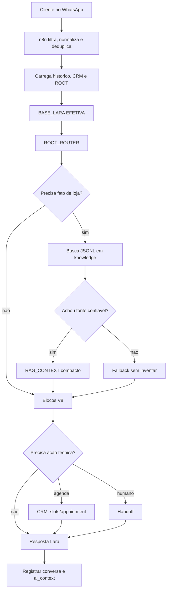

# Plano De Acao Para Implementar A Arquitetura Lara

## Resumo

Este plano transforma a arquitetura documentada da Lara em execução controlada, sem fingir que já existe catálogo online.

Decisão atual:

- não implementar busca de link de produto agora;
- não prometer produto específico com URL;
- implementar primeiro a base factual JSONL sem catálogo online;
- manter comportamento no ROOT;
- manter agendamento e CRM como prioridade operacional;
- deixar catálogo online e produto com link como fase futura bloqueada.

## Critério De Sucesso

A implementação só será considerada boa se:

- Lara parar de inventar produto, preço, estoque, prazo e política;
- Lara consultar uma fonte factual curta antes de responder dúvidas de loja;
- Lara souber dizer "não tenho essa informação confirmada" sem parecer robô;
- agendamento continuar funcionando sem regressão;
- CRM receber contexto útil para o atendente;
- ROOT continuar sendo o lugar de ajuste de comportamento;
- cada mudança tiver backup, teste e rollback claro.

## Escopo Atual

### Dentro Do Escopo

- organizar a fonte de verdade em JSON/JSONL;
- criar base factual inicial sem catálogo online;
- criar buscador interno simples;
- injetar `RAG_CONTEXT` compacto no fluxo;
- ajustar blocos para não prometer produto/link inexistente;
- melhorar `crm_context`;
- criar testes de conversa;
- documentar rollback e critérios de aceite.

### Fora Do Escopo Agora

- crawler de produto;
- link direto de produto;
- preço online;
- estoque online;
- loja virtual;
- painel visual completo no CRM;
- embeddings/vector store;
- mudanças grandes de UI.

Esses itens ficam para depois que existir catálogo online ou fonte estruturada de produtos.

## Arquitetura Alvo Da Fase Atual



## Fonte De Verdade Inicial

Como ainda não existe catálogo online, a primeira RAG deve usar `knowledge/*.jsonl`, não `catalogo/*.jsonl`.

Estrutura inicial:

```text
knowledge/
  loja.jsonl
  atendimento.jsonl
  links.jsonl
  politicas.jsonl
  faq.jsonl
  produtos_genericos.jsonl

catalogo/
  README.md
```

`catalogo/README.md` deve deixar claro:

```text
Catalogo online ainda nao existe.
Esta pasta fica reservada para produto com link quando houver fonte oficial.
Nao usar para prometer disponibilidade, preco ou URL de produto.
```

## Conteudo Inicial Da Base JSONL

### `knowledge/loja.jsonl`

- endereço;
- Google Maps;
- estacionamento;
- horário de atendimento, se confirmado;
- cidade;
- como funciona a visita.

### `knowledge/atendimento.jsonl`

- como a Lara deve conduzir quando cliente quer comprar;
- como explicar ausência de loja online;
- quando oferecer agendamento;
- quando chamar especialista.

### `knowledge/links.jsonl`

- site institucional, se existir;
- Instagram;
- Google Maps;
- links oficiais de contato.

### `knowledge/politicas.jsonl`

- somente políticas confirmadas;
- se não houver política documentada, registrar como `unknown` e usar fallback.

### `knowledge/faq.jsonl`

- perguntas comuns;
- respostas permitidas;
- fallback para especialista.

### `knowledge/produtos_genericos.jsonl`

Esse arquivo não deve listar produto real com link.

Ele pode conter categorias gerais:

- alianças;
- anéis;
- colares;
- brincos;
- pulseiras;
- personalização;
- joias sob medida.

Exemplo de regra:

```jsonl
{"id":"categoria-aliancas","type":"product_category","category":"aliancas","answer_policy":"Pode falar que a ORIN atende clientes interessados em aliancas, mas nao pode confirmar modelo, preco, estoque ou link de produto sem especialista.","next_step":"coletar objetivo, material desejado e oferecer agendamento ou especialista","confidence":"medium"}
```

## Plano De Execucao

### Fase 0: Congelamento E Backup

Objetivo:

- proteger a automação atual antes de qualquer mudança.

Tarefas:

1. Exportar workflow n8n ativo.
2. Salvar backup com data e motivo.
3. Confirmar ID do workflow ativo.
4. Registrar estado atual dos nós críticos.
5. Não disparar teste em cliente real.

Critérios de aceite:

- backup salvo em `backups/`;
- workflow ativo identificado;
- rollback documentado.

### Fase 0.5: QA Local E Simulador Seguro

Objetivo:

- testar conversa como se fosse cliente real, sem enviar WhatsApp e sem alterar CRM.

Tarefas:

1. Criar `qa/lara_qa_scenarios.json`.
2. Criar `scripts/lara_qa_runner.js`.
3. Criar `knowledge/*.jsonl` inicial.
4. Rodar QA local com fixture esperada.
5. Planejar caminho QA no n8n com `qa_mode`.

Critérios de aceite:

- `node scripts/lara_qa_runner.js` passa;
- JSONL valido;
- 14 cenarios passam;
- plano tecnico do simulador documentado em `docs/LARA_QA_SIMULATOR_PLAN.md`;
- nenhum side effect real.

### Fase 1: Ajustar Documentação Para Realidade Sem Catálogo

Objetivo:

- impedir que qualquer implementação assuma produto com link agora.

Tarefas:

1. Atualizar documentação RAG para marcar `catalogo/*.jsonl` como futuro.
2. Atualizar bloco `CATALOGO` para falar de categorias e especialista, não link de produto.
3. Atualizar plano V8 para priorizar `knowledge/*.jsonl`.
4. Criar critérios de aceite específicos para ausência de catálogo online.

Critérios de aceite:

- docs não prometem URL de produto como comportamento atual;
- fase futura de catálogo está separada e bloqueada.

### Fase 2: Criar Base JSONL Inicial

Objetivo:

- criar a primeira fonte factual da Lara sem depender de site/catálogo.

Tarefas:

1. Criar pasta `knowledge/`.
2. Criar schemas JSONL mínimos.
3. Criar registros iniciais de loja, links, atendimento e FAQ.
4. Criar `catalogo/README.md` com bloqueio explícito.
5. Validar JSONL linha a linha.

Critérios de aceite:

- cada linha é JSON válido;
- nenhuma linha promete preço, estoque ou produto específico;
- cada resposta tem `confidence`;
- cada item tem `source` e `updated_at`.

### Fase 3: Buscador Interno Local

Objetivo:

- buscar informações relevantes antes da IA responder.

Tarefas:

1. Implementar busca simples por `topic`, `tags`, `category` e palavras-chave.
2. Retornar no máximo 3 fontes.
3. Gerar `RAG_CONTEXT`.
4. Definir status: `found`, `not_found`, `stale`, `disabled`.
5. Criar log de debug da busca.

Critérios de aceite:

- busca responde em segundos, não minutos;
- IA não recebe arquivo inteiro;
- fallback funciona quando não há fonte.

### Fase 4: Integrar No n8n Sem Quebrar O Fluxo

Objetivo:

- colocar a busca antes do `AI Agent`, preservando ROOT e agenda.

Tarefas:

1. Fazer backup do workflow ativo.
2. Inserir nó de decisão: precisa RAG ou não.
3. Inserir nó de busca JSONL ou subworkflow de busca.
4. Injetar `RAG_CONTEXT` no contexto do AI Agent.
5. Garantir que `BASE_LARA EFETIVA` continue antes dos blocos.
6. Não alterar comportamento no `AI Agent systemMessage` além do contrato técnico necessário.

Critérios de aceite:

- `/root`, `/status`, `/blocks` e agendamento continuam funcionando;
- resposta sobre endereço usa fonte JSONL;
- pergunta sobre produto específico não inventa link;
- pergunta sobre preço cai no bloco correto;
- workflow valida e permanece ativo.

### Fase 5: Melhorar `crm_context`

Objetivo:

- o atendente receber contexto útil no agendamento.

Tarefas:

1. Incluir campos de interesse, categoria, ocasião, urgência e resumo.
2. Registrar quando a resposta usou fonte JSONL.
3. Registrar quando faltou fonte confiável.
4. Enviar `summary_for_human` no `ai_context`.

Critérios de aceite:

- appointment criado contém motivo real;
- atendente vê o que o cliente queria;
- ausência de informação vira contexto, não alucinação.

### Fase 6: Testes De Conversa

Objetivo:

- provar que a automação não está só "bonita no papel".

Cenários obrigatórios:

1. Cliente pergunta endereço.
2. Cliente pergunta estacionamento.
3. Cliente pede catálogo.
4. Cliente pergunta produto específico sem catálogo online.
5. Cliente pergunta preço.
6. Cliente quer personalização.
7. Cliente quer agendar.
8. Cliente escolhe horário.
9. Cliente para de responder.
10. Cliente pede humano.

Critérios de aceite:

- nenhuma resposta inventa produto ou preço;
- agendamento só confirma após CRM;
- Lara pede informação mínima sem virar formulário;
- resposta fica em blocos claros de WhatsApp.

### Fase 7: ROOT Visual E Comandos RAG

Objetivo:

- permitir manutenção pelo WhatsApp/ROOT sem depender de mim ou do n8n.

Comandos planejados:

- `/rag status`
- `/rag buscar [termo]`
- `/rag fonte [id]`
- `/rag log`
- `/rag bloquear [id]`
- `/rag liberar [id]`

Critérios de aceite:

- admin consegue ver a fonte usada;
- admin consegue bloquear informação errada;
- log mostra alteração e autor;
- comandos não disparam mensagem para cliente.

### Fase 8: Catálogo Online Futuro

Status:

- bloqueada até existir fonte oficial de produtos.

Entradas possíveis:

- loja online;
- API do site;
- feed XML/JSON;
- sitemap estruturado;
- painel de produto no CRM;
- planilha oficial controlada.

Quando desbloquear:

1. Criar `catalogo/*.jsonl`.
2. Criar crawler/coletor agendado.
3. Criar detecção de link quebrado.
4. Permitir produto com link somente quando `confidence = high`.
5. Registrar produto citado no `crm_context`.

## Ordem Recomendada

```text
1. Ajustar docs para realidade sem catálogo
2. Criar JSONL de conhecimento da loja
3. Criar buscador local
4. Integrar RAG_CONTEXT no n8n
5. Melhorar crm_context
6. Criar testes de conversa
7. Criar comandos ROOT /rag
8. Só depois, catálogo online
```

## Riscos E Cortes Pragmáticos

| Risco | Decisão |
|---|---|
| Bot prometer produto que não existe | bloquear produto com link até existir catálogo oficial |
| RAG aumentar custo | buscar antes e injetar só fontes pequenas |
| Cliente esperar demais | nunca pedir 3 minutos; fallback para especialista |
| ROOT virar bagunça | comportamento no ROOT, fatos em JSONL, CRM em API |
| n8n quebrar agenda | backup antes, teste depois, rollback claro |
| IA confundir nome do cliente | nome do WhatsApp não é nome confirmado |

## Backlog Inicial

Estes itens ainda não são tasks executáveis completas.

Pelo `dev-workflow-standard`, antes de implementação cada item precisa virar uma task formal com specs obrigatórias, arquivos permitidos, fora de escopo, testes, evidências e critérios de aceite.

### Item 1: Corrigir Documentação Para Sem Catálogo Online

- Status Kanban: Done
- Tipo: Docs
- Prioridade: P0
- Objetivo: remover qualquer premissa de produto com link como recurso atual.
- Arquivos permitidos:
  - `docs/LARA_RAG_JSONL_ARCHITECTURE.md`
  - `docs/LARA_BLOCK_ROUTER_PLAN.md`
  - `docs/LARA_BLOCKS_V1.md`
- Critérios de aceite:
  - produto com link aparece apenas como fase futura;
  - comportamento atual fala em categoria, especialista e agendamento.

### Item 2: Criar Base JSONL Inicial De Conhecimento

- Status Kanban: Discovery / SDD
- Tipo: Feature
- Prioridade: P0
- Objetivo: criar fonte factual inicial sem catálogo.
- Arquivos permitidos:
  - `knowledge/*.jsonl`
  - `catalogo/README.md`
  - `docs/LARA_RAG_JSONL_ARCHITECTURE.md`
- Critérios de aceite:
  - JSONL válido;
  - sem preço, estoque ou produto específico inventado;
  - fonte e data em todos os itens.

### Item 3: Especificar Buscador Interno

- Status Kanban: Discovery / SDD
- Tipo: Feature
- Prioridade: P1
- Objetivo: definir contrato do buscador antes de mexer no n8n.
- Arquivos permitidos:
  - `docs/LARA_RAG_JSONL_ARCHITECTURE.md`
  - `docs/LARA_IMPLEMENTATION_ACTION_PLAN.md`
- Critérios de aceite:
  - entrada, saída, status e limites definidos;
  - `RAG_CONTEXT` documentado;
  - fallback documentado.

### Item 4: Integrar RAG_CONTEXT No n8n

- Status Kanban: Backlog
- Tipo: Feature
- Prioridade: P1
- Objetivo: inserir busca factual antes do AI Agent.
- Condição de entrada:
  - Task 2 e Task 3 concluídas.
- Critérios de aceite:
  - workflow com backup;
  - validação n8n;
  - agendamento preservado;
  - testes de conversa executados.

## Decisão Final

O caminho certo agora não é catálogo de produto.

O caminho certo agora é:

```text
RAG factual minima
→ Lara para de inventar
→ CRM recebe contexto melhor
→ agendamento fica estável
→ depois produto com link quando existir catálogo oficial
```
