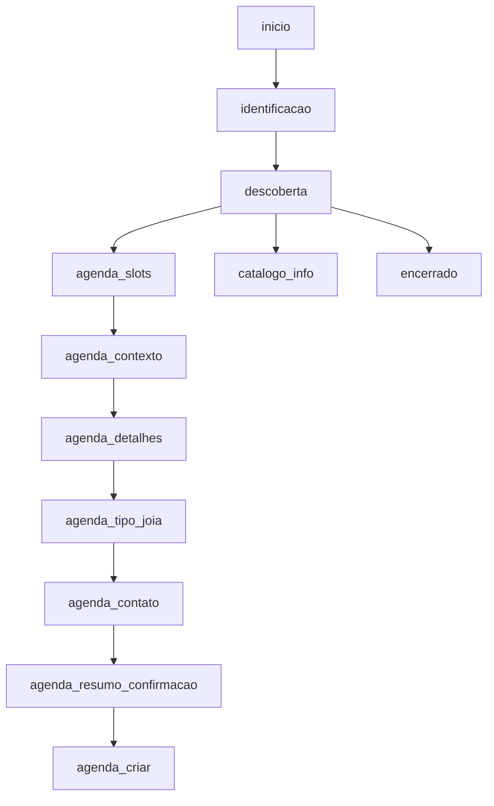
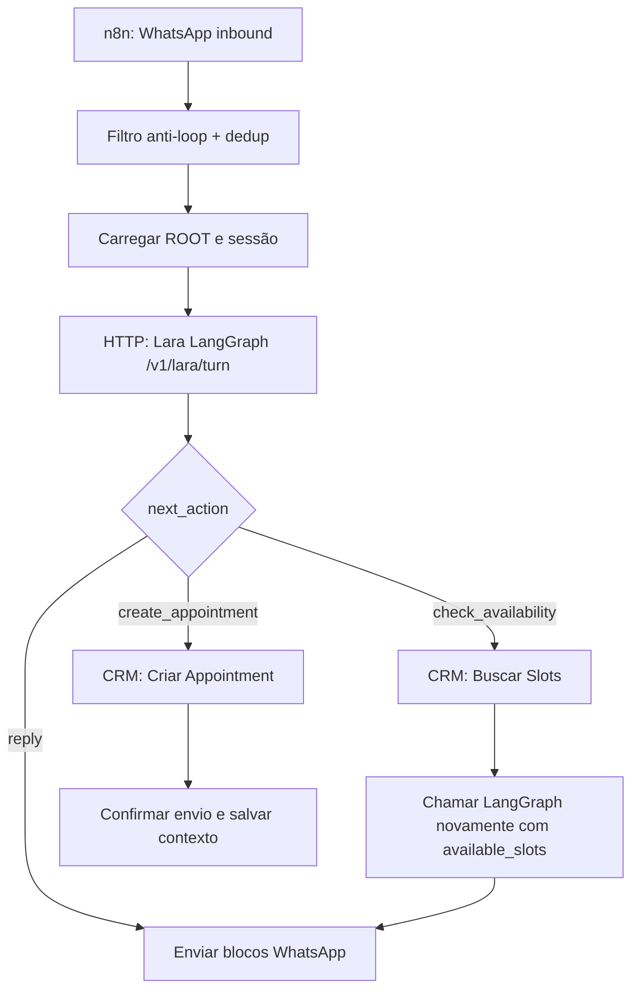

# Lara LangGraph Runtime

## Decisão

O gargalo atual deixou de ser só ajuste de prompt. A Lara precisa de controle de estado fora do prompt livre.

Decisão aplicada neste repositório:

```text
n8n fica como shell de WhatsApp, ROOT, CRM e envio.
LangGraph vira runtime de decisão conversacional da Lara.
```

## O Que Foi Implementado

Arquivos:

- `lara_langgraph/graph.py`: grafo de estados da Lara.
- `lara_langgraph/service.py`: API FastAPI para o n8n chamar.
- `tests/test_lara_langgraph.py`: QA de jornadas críticas.
- `requirements-langgraph.txt`: dependências.
- `Dockerfile.langgraph`: imagem para hospedar o serviço.

Fonte técnica validada:

- `https://github.com/langchain-ai/langgraph.git`
- commit pesquisado localmente: `5931a5f`
- API confirmada: `StateGraph`, `START`, `END`, `add_conditional_edges`, `compile(checkpointer=...)`, `graph.invoke(..., {"configurable": {"thread_id": "..."}})`

Endpoint:

```http
POST /v1/lara/turn
```

Entrada:

```json
{
  "session_id": "wa:+5547999990000",
  "phone": "+5547999990000",
  "profile_name": "Nome do perfil, apenas informativo",
  "message": "Boa noite",
  "state": {},
  "available_slots": []
}
```

Importante:

- `session_id` vira `thread_id` do LangGraph.
- A memória curta usa checkpointer do LangGraph.
- `state` continua aceito por compatibilidade com o n8n atual, mas não deve ser a única fonte de memória em produção.

Saída:

```json
{
  "reply_blocks": [],
  "intent": "identification|discovery|appointment|catalog|closing",
  "conversation_stage": "identificacao|descoberta|agenda_slots|agenda_contexto|agenda_detalhes|agenda_tipo_joia|agenda_contato|agenda_resumo_confirmacao|agenda_criar|encerrado",
  "lead_temperature": "frio|morno|quente",
  "collected_context": {},
  "missing_fields": [],
  "next_action": "reply|check_availability|create_appointment",
  "tool_payload": {},
  "crm_note": "",
  "state": {},
  "safety": {
    "used_confirmed_facts_only": true,
    "needs_human": false
  }
}
```

## Estados Implementados



## Regras Críticas Implementadas

- Saudação não vira nome.
- Nome de perfil do WhatsApp não vira nome confirmado.
- Memória curta por `session_id` via checkpointer LangGraph.
- Depois que o cliente informa nome, a Lara vai para descoberta, não repete abertura.
- Erro de digitação simples em agendamento é entendido, como `qro agenda uma vizta`.
- Horário escolhido não cria appointment imediatamente.
- Antes de criar appointment, Lara coleta motivo da visita.
- Antes de pedir e-mail, Lara coleta contexto consultivo da compra.
- Antes de pedir e-mail, Lara identifica se o cliente quer joia pronta ou personalizada.
- E-mail e confirmação do WhatsApp são coletados antes do resumo final.
- Antes de criar appointment, Lara resume e pede confirmação.
- Se o cliente corrigir o resumo, Lara atualiza o contexto e confirma novamente.
- Pergunta direta de endereço responde somente a fonte oficial da loja, sem
  iniciar agendamento.
- Pedido de atendente/especialista gera handoff e pausa respostas automáticas
  posteriores na conversa.
- Endereço fixo correto:
  - `Av. Brasil, 1500 - Centro, Balneário Camboriú - SC, 88330-901`

## Como Rodar Local

```bash
python3 -m venv .venv-langgraph
. .venv-langgraph/bin/activate
pip install -r requirements-langgraph.txt
uvicorn lara_langgraph.service:app --host 0.0.0.0 --port 8080
```

Health check:

```bash
curl http://127.0.0.1:8080/health
```

Exemplo:

```bash
curl -s http://127.0.0.1:8080/v1/lara/turn \
  -H 'Content-Type: application/json' \
  -d '{"session_id":"wa:+5547999990000","phone":"+5547999990000","message":"Boa noite","state":{}}'
```

## Como O n8n Deve Integrar

O fluxo remoto não deve tentar rodar LangGraph dentro de Code node.

Integração correta:



O n8n continua responsável por:

- receber webhook;
- bloquear mensagem própria;
- deduplicar;
- carregar ROOT;
- buscar slots;
- criar appointment;
- enviar WhatsApp;
- salvar histórico.

LangGraph fica responsável por:

- decidir estado;
- capturar nome confirmado;
- capturar motivo;
- capturar detalhes consultivos da visita;
- capturar preferência entre joia pronta e personalizada;
- capturar e-mail e confirmação do WhatsApp antes do CRM;
- montar resposta em blocos;
- decidir próxima ação;
- gerar `crm_note`.

## Memória

A versão local usa `InMemorySaver` para o grafo e um cache por `session_id`.

Em produção, o cache da Lara também é persistido em arquivo JSON quando a variável
`LARA_STATE_FILE` está configurada. No VPS atual:

```text
LARA_STATE_FILE=/data/lara_sessions.json
```

O container `lara-langgraph` monta um volume Docker em `/data`, então o estado
continua disponível após restart/recreate simples do serviço.

Limite técnico ainda aberto:

- a persistência por arquivo reduz reset de conversa, mas não é a solução final para alta concorrência;
- a versão definitiva deve migrar o checkpointer/estado para Postgres ou Redis durável;
- o `thread_id` deve continuar derivado do número/conversa e nunca gerado pela IA.

## Estado Operacional Atual

O bloqueio de hospedagem foi resolvido.

O runtime LangGraph roda no VPS como container separado, na mesma rede Docker do n8n.

Endpoint interno usado pelo n8n:

```text
http://lara-langgraph:8080/v1/lara/turn
```

Health check de dentro do container n8n:

```bash
docker exec n8n-zcac-n8n-1 wget -qO- http://lara-langgraph:8080/health
```

Resultado esperado:

```json
{"status":"ok"}
```

## Correções Recentes

- confirmação final como `Sim é isso mesmo` não sobrescreve mais o motivo da visita;
- `/rclear` limpa a sessão no LangGraph antes de qualquer etapa conversacional;
- saudação simples após reset não duplica `tudo bem`;
- sessões contaminadas de teste foram removidas do arquivo persistido remoto.

## Próximo Passo Real

Validar a conversa real pelo WhatsApp depois da última correção:

1. enviar `/rclear`;
2. confirmar reset;
3. iniciar com `Olá`;
4. completar a jornada de agendamento;
5. conferir appointment no CRM;
6. registrar a execution id no issue `ORION-CRM#14`.
