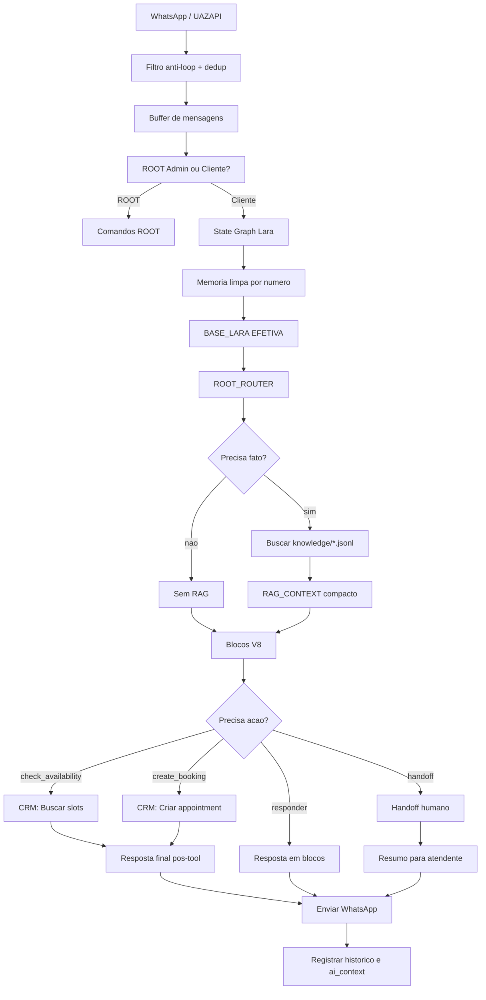

# Plano Mestre De Execucao Da Lara

## Resumo

Este é o plano completo da Lara, consolidando tudo que foi decidido desde o início da manutenção até agora.

Objetivo final:

```text
Lara atender no WhatsApp com comportamento humano, memória limpa, fonte factual controlada, agendamento correto, CRM bem preenchido e QA antes de produção.
```

Decisão técnica principal:

- n8n continua como orquestrador principal agora;
- ROOT continua como sistema operacional de comportamento da Lara;
- `knowledge/*.jsonl` vira fonte factual inicial;
- catálogo com link de produto fica para fase futura;
- arquitetura em grafo passa a ser implementada em LangGraph como runtime externo;
- n8n continua como orquestrador de WhatsApp, ROOT, CRM, agenda, envio e histórico;
- o workflow remoto só deve chamar LangGraph depois que existir uma URL estável acessível pelo n8n;
- antes de mexer em produção, tudo passa por QA local e simulador sem side effects.

Referência técnica adicional:

- `docs/LARA_REFERENCE_REPOS_AUDIT.md`: auditoria dos repositórios `sdr-evolufit` e `Sistema-SDR-Multiagentes`, usada para definir a Lara V9.
- `docs/LARA_LANGGRAPH_RUNTIME.md`: runtime LangGraph implementado para controlar estado, intenção e contrato JSON da Lara.

## Principios Não Negociáveis

- Não testar em cliente real.
- Não mandar WhatsApp em modo QA.
- Não criar appointment real em modo QA.
- Não ajustar comportamento direto no `AI Agent systemMessage`.
- Não prometer preço, estoque, prazo, garantia, material ou link de produto sem fonte.
- Não usar nome de perfil do WhatsApp como nome confirmado.
- Não deixar a IA decidir tudo com contexto solto.
- Não criar appointment sem motivo da visita e resumo confirmado pelo cliente.
- Não tratar saudação, horario, confirmação curta ou comando como nome do cliente.
- Não publicar integração LangGraph no remoto sem URL estável, health check e fallback.

## Arquitetura Final Planejada



## Fases De Execução

### Fase 0: Backup E Governança

Status: parcialmente concluída.

Objetivo:

- proteger o workflow ativo e evitar nova bagunça em produção.

Entregas:

- backups do workflow;
- documentação da arquitetura atual;
- regra de separação entre ROOT e workflow.

Critério de aceite:

- existe backup antes de cada alteração n8n;
- alteração de comportamento vai pelo ROOT;
- bug técnico vai pelo workflow;
- rollback documentado.

Arquivos relacionados:

- `docs/ORION_WF_BOT_V7_CURRENT_FLOW.md`
- `docs/LARA_ROOT_ARCHITECTURE.md`
- `backups/`

### Fase 1: ROOT Como Sistema Operacional Da Lara

Status: parcialmente implementada no workflow.

Objetivo:

- manter comportamento da Lara em `LARA_ROOT_CONFIG`, não preso no `AI Agent`.

Entregas:

- comandos ROOT;
- `/help`, `/tutorial`, `/log`;
- `audit_log`;
- `root_blocks`;
- `BASE_LARA EFETIVA`;
- blocos V8.

Critério de aceite:

- `/root` funciona;
- `/status` mostra configuração;
- `/blocks` lista blocos;
- `/block [nome]` mostra bloco;
- `/setblock nome|texto` altera com confirmação;
- `/log` mostra quem mexeu.

Risco aberto:

- verificar se ROOT atual de produção está exatamente igual à documentação.

### Fase 2: Memória E State Graph Da Lara

Status: planejada, ainda não implementada como estado explícito completo.

Objetivo:

- parar mistura de contexto, nome e etapa de conversa.

Estados mínimos:

- `inicio`;
- `identificacao`;
- `descoberta`;
- `informacao`;
- `catalogo_sem_link`;
- `preco_condicoes`;
- `agendamento_consulta`;
- `agendamento_coleta_dados`;
- `agendamento_confirmado`;
- `pos_agendamento`;
- `handoff`;
- `inativo`;
- `encerrado`.

Memória permitida:

- `confirmed_name`;
- `whatsapp_number`;
- `conversation_state`;
- `last_intent`;
- `last_offered_slots`;
- `pending_booking`;
- `crm_context`;
- `last_bot_action`;
- `last_customer_message_at`.

Memória proibida:

- nome de outro cliente;
- resumo genérico sem número;
- perfil do WhatsApp como nome confirmado;
- dados de agenda não retornados pelo CRM;
- preço/estoque sem fonte.

Critério de aceite:

- cada número tem memória isolada;
- nome só vira confirmado depois que cliente informa/confirma;
- state muda de forma rastreável;
- QA-13 não chama cliente pelo nome errado.

### Fase 3: Fonte Factual JSONL

Status: primeira versão local implementada.

Objetivo:

- reduzir alucinação em loja, atendimento, política, links e categorias.

Entregas já criadas:

- `knowledge/loja.jsonl`;
- `knowledge/atendimento.jsonl`;
- `knowledge/links.jsonl`;
- `knowledge/politicas.jsonl`;
- `knowledge/faq.jsonl`;
- `knowledge/produtos_genericos.jsonl`;
- `catalogo/README.md`.

Critério de aceite:

- JSONL válido;
- todo item tem `id`, `source`, `type`, `confidence`, `updated_at`;
- não há preço, estoque ou URL de produto inventada;
- catálogo online fica bloqueado até existir fonte oficial.

### Fase 4: Buscador Interno E RAG_CONTEXT

Status: planejada.

Objetivo:

- buscar fatos antes da IA responder.

Contrato:

```json
{
  "retrieval_status": "found|not_found|stale|disabled",
  "query": "texto buscado",
  "sources": [],
  "instruction": "Responder usando somente estas fontes."
}
```

Critério de aceite:

- retorna no máximo 3 fontes na fase atual;
- não manda JSONL inteiro para IA;
- se não encontrar fonte, Lara usa fallback;
- produto específico sem catálogo vira `catalog_status = catalogo_online_indisponivel`.

### Fase 5: QA Local

Status: implementada.

Objetivo:

- validar conversa esperada antes de mexer no n8n real.

Entregas:

- `docs/LARA_QA_CONVERSATION_TESTS.md`;
- `qa/lara_qa_scenarios.json`;
- `scripts/lara_qa_runner.js`;
- `qa/lara_qa_report.json`.

Validação atual:

```text
node scripts/lara_qa_runner.js
Knowledge JSONL: OK
Scenarios: 14/14 passed
```

Critério de aceite:

- 14 cenários passam;
- padrões proibidos são detectados;
- JSONL é validado;
- arquivo real capturado do n8n pode ser testado com `--actual`.

### Fase 6: QA Simulator No n8n

Status: planejada, próxima fase técnica.

Objetivo:

- rodar o fluxo real da Lara em modo seguro, sem side effects.

Entregas planejadas:

- entrada `qa_mode`;
- número fake obrigatório;
- bloqueio de envio WhatsApp;
- mock de `check_availability`;
- mock de `create_booking`;
- mock de `handoff`;
- geração de `qa/lara_actual_outputs.json`.

Critério de aceite:

- modo QA não alcança nó real de WhatsApp;
- modo QA não alcança endpoint real de CRM;
- 14 cenários rodam;
- `node scripts/lara_qa_runner.js --actual qa/lara_actual_outputs.json` passa.

### Fase 7: Integração RAG No n8n

Status: planejada depois do simulador.

Objetivo:

- injetar `RAG_CONTEXT` compacto antes do AI Agent no fluxo real.

Critério de aceite:

- perguntas de endereço usam `knowledge/loja.jsonl`;
- perguntas de catálogo usam `knowledge/atendimento.jsonl` e `produtos_genericos`;
- perguntas de preço caem em fallback;
- produto com link não é prometido;
- agendamento não sofre regressão.

### Fase 8: Agendamento E CRM Context

Status: parcialmente implementada, precisa QA real.

Objetivo:

- garantir que appointment só seja confirmado com CRM e que o atendente receba contexto.

Campos mínimos:

- `customer_name`;
- `whatsapp_number`;
- `visit_reason`;
- `interesse`;
- `material`;
- `ocasiao`;
- `orcamento`;
- `urgencia`;
- `summary_for_human`;
- `recommended_next_step`;
- `catalog_status`.

Critério de aceite:

- sem nome completo, Lara pede nome;
- sem motivo real, Lara pede motivo;
- horário só vem do CRM;
- confirmação só vem depois de `create_booking`;
- endereço só vai depois de confirmação ou quando cliente pedir localização.

### Fase 9: Inatividade E Encerramento

Status: planejada.

Objetivo:

- não deixar cliente sem resposta nem ficar insistindo.

Regra:

- após 5 minutos sem resposta em atendimento ativo, perguntar se ainda deseja continuar;
- se continuar sem resposta, marcar como inativo ou handoff conforme política;
- não enviar várias mensagens repetidas.

Critério de aceite:

- QA-11 passa no simulador real;
- não dispara mensagem infinita;
- estado muda para `inativo` ou `encerrado`.

### Fase 10: Handoff Humano

Status: parcialmente existente, precisa QA.

Objetivo:

- encaminhar para especialista quando cliente pedir humano, quando Lara não tiver fonte ou quando houver risco comercial.

Critério de aceite:

- cliente não precisa repetir tudo;
- atendente recebe resumo;
- Lara não insiste em resolver quando cliente pediu humano.

### Fase 11: Painel Visual ROOT

Status: futuro.

Objetivo:

- permitir configurar Lara sem depender de Codex ou n8n.

Escopo futuro:

- visualizar `BASE_LARA`;
- editar blocos;
- ver logs;
- testar cenários;
- bloquear fontes RAG;
- revisar prompt publicado.

Não fazer agora:

- painel bonito antes do bot funcionar;
- editor visual complexo sem QA real.

### Fase 12: Catálogo Online Futuro

Status: bloqueada.

Desbloqueia quando existir:

- loja online;
- API;
- feed;
- sitemap estruturado;
- planilha oficial controlada;
- cadastro de produto no CRM.

Critério de aceite futuro:

- produto com URL só se fonte oficial existir;
- link quebrado bloqueia item;
- preço/estoque só se fonte permitir;
- `catalogo/*.jsonl` validado.

### Fase 13: LangGraph Futuro Opcional

Status: não recomendado agora.

Quando considerar:

- n8n ficar difícil para controlar estado;
- necessidade de testes automatizados de estado mais robustos;
- múltiplos agentes especializados;
- checkpoints e replay de conversas;
- observabilidade de decisão mais forte.

Decisão atual:

- aplicar conceito de state graph dentro do n8n primeiro;
- não migrar sem prova de gargalo.

## Ordem De Execução Recomendada

```text
1. Congelar e backup do workflow ativo
2. Confirmar ROOT atual de produção
3. Implementar State Graph mínimo no n8n
4. Implementar QA Simulator no n8n
5. Capturar outputs reais dos 14 cenários
6. Rodar runner com --actual
7. Corrigir ROOT/blocos/memória até passar
8. Integrar buscador knowledge/*.jsonl
9. Repetir QA real
10. Validar agendamento e CRM context
11. Só depois testar no número WhatsApp de teste
12. Só depois pensar em painel e catálogo futuro
```

## Proxima Ação Técnica

Implementar `qa_mode` no workflow n8n.

Antes disso:

- exportar backup do workflow ativo;
- validar nós atuais de envio WhatsApp e CRM;
- criar caminho isolado para simulação;
- impedir side effects por condição explícita.

## Definição De Pronto Geral

A Lara só pode ser considerada pronta quando:

- QA local passa;
- QA simulator n8n passa;
- teste no número de teste passa;
- CRM recebe contexto útil;
- agendamento não confirma cedo;
- memória não mistura nomes;
- fallback impede alucinação;
- ROOT mostra e registra alterações;
- nenhum cliente real é usado como teste.
