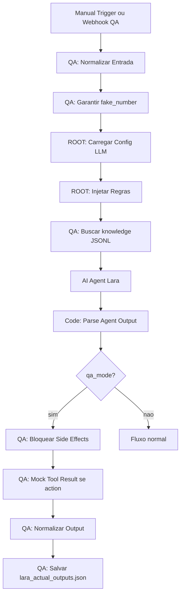

# Plano Tecnico Do LARA QA Simulator

## Resumo

O LARA QA Simulator é um modo seguro para testar a Lara como se fosse conversa real, sem enviar WhatsApp, sem criar appointment e sem alterar lead real.

Objetivo:

```text
mensagem simulada
→ mesmo ROOT
→ mesma memoria controlada
→ mesmos blocos
→ mesma logica de action
→ output capturado
→ validacao contra qa/lara_qa_scenarios.json
```

## O Que Ja Existe Localmente

- `knowledge/*.jsonl`: primeira base factual sem catalogo online.
- `catalogo/README.md`: bloqueio explicito de produto com link.
- `qa/lara_qa_scenarios.json`: 14 cenarios de QA.
- `qa/lara_actual_outputs.example.json`: modelo para capturar respostas reais.
- `scripts/lara_qa_runner.js`: runner local de validacao.
- `qa/lara_qa_report.json`: relatorio gerado pelo runner.

Comando local:

```bash
node scripts/lara_qa_runner.js
```

Comando local com respostas reais capturadas:

```bash
node scripts/lara_qa_runner.js --actual qa/lara_actual_outputs.json
```

Comando para capturar respostas reais do n8n QA Simulator:

```bash
N8N_API_KEY=... python3 scripts/lara_n8n_qa_smoke.py --ids QA-01
node scripts/lara_qa_runner.js --actual qa/lara_actual_outputs.json --allow-partial
```

Para rodar todos os cenarios, sabendo que isso consome chamadas de LLM:

```bash
N8N_API_KEY=... python3 scripts/lara_n8n_qa_smoke.py --all
node scripts/lara_qa_runner.js --actual qa/lara_actual_outputs.json
```

## Princípios Do Simulador

O simulador deve usar o máximo possível do fluxo real, mas bloquear efeitos colaterais.

Permitido:

- carregar ROOT;
- montar contexto;
- chamar AI Agent;
- gerar action proposta;
- gerar `crm_context`;
- registrar log de QA separado.

Proibido:

- enviar WhatsApp;
- criar appointment real;
- atualizar lead real;
- notificar atendente real;
- gravar histórico do cliente real;
- usar número real como chave de memória.

## Contrato De Entrada

```json
{
  "qa_mode": true,
  "scenario_id": "QA-04",
  "fake_number": "+550000000004",
  "message": "Tem aliança em ouro 17k de 3mm?",
  "profile_name": "Cliente QA",
  "conversation_state": {
    "confirmed_name": null,
    "last_offered_slots": [],
    "pending_booking": null
  }
}
```

Regras:

- `qa_mode` precisa ser `true`;
- `fake_number` deve começar com `+550000000`;
- nunca usar número real de cliente;
- cada cenário deve ter chave de memória isolada.

## Contrato De Saída

```json
{
  "scenario_id": "QA-04",
  "type": "response",
  "action": null,
  "message_blocks": [
    "Ainda não tenho um catálogo online com link direto desse modelo.",
    "Mas consigo encaminhar para uma especialista verificar as opções disponíveis para você.",
    "É para casamento, noivado ou outro momento especial?"
  ],
  "crm_context": {
    "interesse": "aliança em ouro 17k de 3mm",
    "catalog_status": "catalogo_online_indisponivel",
    "summary_for_human": "Cliente perguntou sobre aliança em ouro 17k de 3mm. Lara não prometeu link, preço ou estoque."
  },
  "side_effects_blocked": true
}
```

## Desenho No n8n



## Mock De Ferramentas

### `check_availability`

Quando a Lara pedir horários em QA, retornar fixo:

```json
{
  "slots": [
    "2026-07-01T09:00:00-03:00",
    "2026-07-01T10:00:00-03:00",
    "2026-07-01T11:00:00-03:00"
  ]
}
```

### `create_booking`

Quando a Lara tentar criar appointment em QA, não chamar CRM.

Retornar:

```json
{
  "success": true,
  "qa_mock": true,
  "appointment_id": "QA-MOCK-APPOINTMENT",
  "message": "Appointment simulado. Nenhum CRM real foi alterado."
}
```

### `handoff`

Quando a Lara pedir humano em QA, não notificar atendente.

Retornar:

```json
{
  "success": true,
  "qa_mock": true,
  "handoff_id": "QA-MOCK-HANDOFF"
}
```

## Critérios De Aprovação Para Integrar No n8n

- workflow exportado antes da alteração;
- caminho `qa_mode` isolado por IF/Switch;
- zero conexão do modo QA com envio WhatsApp real;
- zero conexão do modo QA com CRM create/update real;
- número fake obrigatório;
- 14 cenários executados;
- `qa/lara_actual_outputs.json` gerado;
- `node scripts/lara_qa_runner.js --actual qa/lara_actual_outputs.json` passa.

## Ordem De Implementação No n8n

1. Backup do workflow ativo.
2. Criar entrada QA por Manual Trigger ou Webhook interno.
3. Reutilizar ROOT e blocos.
4. Inserir busca `knowledge/*.jsonl`.
5. Bloquear side effects com `qa_mode`.
6. Criar mocks de `check_availability`, `create_booking` e `handoff`.
7. Gerar output compatível com `qa/lara_actual_outputs.json`.
8. Validar com runner local.
9. Só depois considerar teste no número WhatsApp de teste.

## Condição De Parada

Parar imediatamente se:

- o modo QA alcançar nó de envio WhatsApp;
- o modo QA alcançar endpoint real de appointment;
- o modo QA usar número real;
- a Lara confirmar agendamento sem mock/CRM;
- qualquer cenário P0 falhar.

## Decisão Técnica

Implementar primeiro o QA local e o simulador sem side effects.

Não migrar para LangGraph agora.

Não testar em cliente real.

Não criar catálogo online falso.
