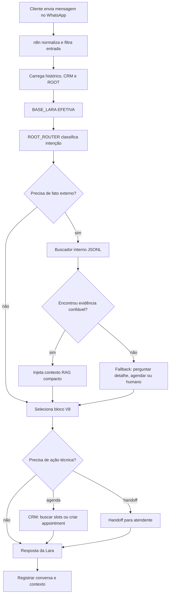
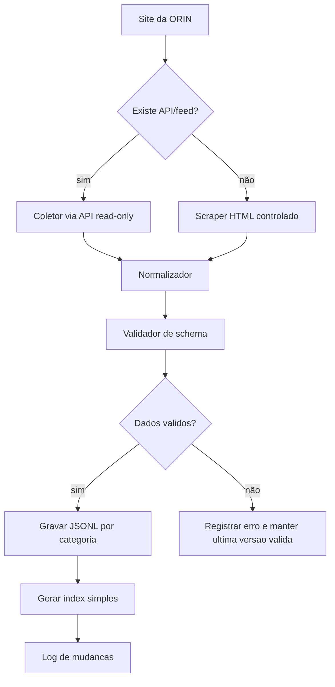

# Arquitetura Lara RAG JSONL

## Resumo Executivo

A Lara deve ter duas formas de enxergar o mesmo conhecimento:

- uma versão visual no ROOT, feita para humanos configurarem, auditarem e entenderem;
- uma versão compacta em JSON/JSONL, feita para o n8n e a IA consumirem com menos token e mais precisão.

Essa camada não substitui `BASE_LARA`, `ROOT_ROUTER` nem os blocos V8. Ela entra como fonte de conhecimento consultável quando o cliente pede informação factual sobre loja, política, atendimento, endereço, links, dúvidas recorrentes e, futuramente, produto.

Estado atual: ainda não existe catálogo online oficial. Portanto, link direto de produto e busca de produto específico são fase futura, bloqueada até existir fonte oficial.

Regra central:

```text
BASE_LARA define comportamento.
ROOT_ROUTER decide intenção.
BLOCOS definem roteiro.
RAG JSONL fornece fatos confirmados.
CRM fornece contexto do cliente e agenda.
```

## Problema Que Esta Arquitetura Resolve

Hoje a Lara pode errar por três motivos diferentes:

- mistura comportamento com informação factual;
- tenta responder produto, material ou política sem fonte verificável;
- recebe contexto demais no prompt ou contexto genérico demais para decidir com precisão.

O objetivo da RAG JSONL é fazer a Lara responder usando evidências pequenas e filtradas, em vez de mandar para a IA um prompt gigante com tudo que a loja sabe.

## Decisão De Arquitetura

Não vamos fazer a IA ler arquivos grandes diretamente.

O fluxo correto é:

1. Uma base inicial manual/controlada cria os fatos oficiais da loja.
2. Futuramente, um coletor cria o espelho do site e das fontes oficiais de produto.
3. Esse conteúdo vira arquivos JSONL categorizados.
4. Um buscador interno consulta esses arquivos antes da IA responder.
5. A IA recebe apenas os 3 a 5 itens mais relevantes.
6. Se não houver evidência confiável, Lara não inventa e conduz para especialista ou agendamento.

## Fluxograma Geral



## Camadas Da Arquitetura

| Camada | Fonte | Quem edita | Quem consome | Função |
|---|---|---|---|---|
| `BASE_LARA EFETIVA` | ROOT Redis | Admin via WhatsApp/ROOT | IA | Persona, tom, limites e regras globais |
| `ROOT_ROUTER` | ROOT Redis | Admin técnico | IA/n8n | Escolher intenção, etapa e bloco |
| `blocks` | ROOT Redis | Admin via comandos/painel futuro | IA | Roteiros situacionais de atendimento |
| `knowledge/*.jsonl` | ROOT/docs oficiais | Admin/coletor | Buscador interno | FAQ, endereço, políticas, links e regras comerciais |
| `catalogo/*.jsonl` | Site/API/scraper futuro | Coletor automático futuro | Buscador interno | Produtos, categorias, materiais, links e imagens quando houver catálogo oficial |
| CRM API | Orion CRM | Sistema | n8n/IA | Cliente, agenda, lead, histórico e contexto comercial |

## Fonte Da Verdade: Visual E Máquina

### Versão Visual

A versão visual é para humano.

Ela deve aparecer no ROOT ou painel futuro com:

- título do bloco;
- descrição;
- quando usar;
- exemplos de resposta;
- links oficiais;
- campos que precisa coletar;
- histórico de alteração;
- botão/comando para publicar.

Exemplo visual:

```text
Bloco: CATALOGO
Quando usar: cliente pede modelos, peças, site, inspiração ou produto específico.
Objetivo atual: explicar ausência de catálogo online, coletar intenção e conduzir para especialista ou agendamento.
Objetivo futuro: consultar catálogo antes de responder sobre produto específico.
Fallback: se não houver fonte oficial, não inventar e conduzir para especialista.
```

### Versão JSON/JSONL

A versão JSON/JSONL é para máquina.

Ela deve ser curta, estruturada e fácil de buscar:

```json
{
  "id": "catalogo",
  "type": "conversation_block",
  "intent": ["catalogo", "produto", "modelo", "site"],
  "rules": [
    "na fase atual, nao prometer link de produto porque ainda nao existe catalogo online oficial",
    "quando existir catalogo oficial, consultar catalogo_jsonl antes de responder sobre produto especifico",
    "nao inventar preco, estoque ou disponibilidade",
    "se nao houver produto confiavel, conduzir para especialista ou agendamento"
  ],
  "fallback": "Nao encontrei esse modelo exato aqui. Posso verificar com uma especialista ou te ajudar a agendar um atendimento."
}
```

Regra: o ROOT pode mostrar bonito, mas o n8n deve injetar enxuto.

## Estrutura De Arquivos Recomendada

```text
knowledge/
  loja.jsonl
  faq.jsonl
  politicas.jsonl
  links.jsonl
  atendimento.jsonl
  produtos_genericos.jsonl

catalogo/
  README.md
  aliancas.jsonl              # futuro
  aneis.jsonl                 # futuro
  brincos.jsonl               # futuro
  colares.jsonl               # futuro
  pulseiras.jsonl             # futuro
  personalizados.jsonl        # futuro
  outros.jsonl                # futuro

indexes/
  catalog_index.json
  synonyms.json
  last_sync.json

logs/
  catalog_sync.jsonl
  retrieval_debug.jsonl
```

## Modelo JSONL De Produto

Status: futuro.

Usar este modelo somente quando existir catálogo online, API, feed, planilha oficial ou fonte estruturada confiável.

Cada linha representa um produto ou item de catálogo independente.

```jsonl
{"id":"alianca-ouro-17k-3mm","source":"site","category":"aliancas","name":"Alianca Ouro 17k 3mm","material":"ouro 17k","description":"Modelo em 3mm de largura e 1,3 de espessura.","url":"https://site/produto/alianca-ouro-17k-3mm","image_url":"https://site/imagem.jpg","tags":["alianca","ouro 17k","casamento","3mm"],"availability":"unknown","price_policy":"consultar especialista","updated_at":"2026-06-29T00:00:00-03:00"}
```

Campos mínimos:

- `id`: identificador estável.
- `source`: origem, como `site`, `crm`, `manual` ou `root`.
- `category`: categoria principal.
- `name`: nome exibível.
- `material`: material quando existir.
- `description`: descrição curta.
- `url`: link oficial.
- `image_url`: imagem principal quando existir.
- `tags`: palavras de busca.
- `availability`: `available`, `unavailable`, `unknown` ou `on_request`.
- `price_policy`: regra de preço, não valor inventado.
- `updated_at`: data da última sincronização.

## Modelo JSONL De Conhecimento

Usado para FAQ, loja, endereço, políticas e atendimento.

```jsonl
{"id":"loja-endereco-principal","source":"root","type":"store_info","topic":"endereco","title":"Endereco ORIN Joias","answer":"ORIN Joias, Av. Brasil, 1500 - Centro, Balneario Camboriu - SC, 88330-901.","url":"https://maps.app.goo.gl/geMC3hHsQqGfSnnm6","tags":["endereco","localizacao","maps","loja"],"confidence":"high","updated_at":"2026-07-01T00:00:00-03:00"}
```

Campos mínimos:

- `id`
- `source`
- `type`
- `topic`
- `title`
- `answer`
- `url`
- `tags`
- `confidence`
- `updated_at`

## Fluxo De Sincronização Do Catálogo

Status: futuro, bloqueado até existir catálogo online oficial.



Princípio operacional:

- sincronização não acontece durante a conversa;
- conversa consulta cache local;
- se o site cair, Lara continua usando a última versão válida;
- se o produto sumir ou a URL quebrar, o item deve ser marcado como suspeito e não usado como evidência forte.

## Buscador Interno

O buscador interno deve rodar antes da chamada principal da IA quando a intenção exigir fato.

Critérios de busca:

- categoria detectada;
- material citado;
- nome ou termo específico;
- ocasião;
- tags;
- sinônimos;
- similaridade simples;
- recência da fonte;
- confiança da fonte.

Saída compacta para a IA:

```json
{
  "retrieval_status": "found",
  "query": "catalogo de aliancas",
  "sources": [
    {
      "id": "categoria-aliancas",
      "name": "Atendimento para aliancas",
      "summary": "A ORIN atende clientes interessados em aliancas, mas ainda nao ha catalogo online oficial com links de produto.",
      "url": "https://www.instagram.com/orinjoias/",
      "confidence": 0.82
    }
  ],
  "instruction": "Responder usando somente estas fontes. Nao inventar preco, estoque ou prazo."
}
```

Limite recomendado:

- máximo de 5 resultados por resposta;
- máximo de 900 a 1500 caracteres de contexto RAG;
- nunca mandar o arquivo JSONL inteiro para a IA.

## Quando Consultar A RAG JSONL

Consultar quando a intenção for:

- endereço;
- horário de funcionamento;
- estacionamento;
- links oficiais;
- ausência de loja online;
- atendimento consultivo;
- política confirmada;
- FAQ;
- categoria genérica de joia, sem prometer produto específico;
- produto específico somente no futuro, quando existir catálogo oficial;
- material somente se houver fonte confirmada;
- garantia somente se houver fonte confirmada;
- personalização.

Não consultar quando:

- cliente só cumprimenta;
- cliente informa nome;
- cliente escolhe horário já oferecido;
- fluxo está apenas criando agendamento;
- a resposta depende só do CRM;
- a resposta é puramente comportamental.

## Contrato Com A Lara

A Lara deve receber o contexto assim:

```text
<ROOT_CONFIG>
BASE_LARA EFETIVA...
ROOT_ROUTER...
BLOCOS...
</ROOT_CONFIG>

<RAG_CONTEXT>
status: found
fontes:
1. Atendimento consultivo ORIN
Resumo: Ainda nao existe catalogo online oficial com links de produto. Para produto especifico, coletar interesse e conduzir para especialista ou agendamento.
Link: https://www.instagram.com/orinjoias/
Instrucao: nao prometer link de produto, preco ou estoque.
</RAG_CONTEXT>
```

Regra de resposta:

- se `RAG_CONTEXT.status = found`, responder usando as fontes;
- se `RAG_CONTEXT.status = not_found`, não inventar;
- se `RAG_CONTEXT.status = stale`, avisar que vai confirmar com especialista;
- se o cliente demonstrar intenção de compra, conduzir para especialista ou agendamento.

## Fallbacks

### Produto Não Encontrado

```text
Não encontrei esse modelo exato aqui na minha base.
Posso verificar com uma especialista ou te ajudar a agendar um atendimento para ver opções parecidas.
```

### Busca Lenta Ou Indisponível

Não pedir 3 minutos de espera.

Resposta correta:

```text
Vou confirmar essa informação com a equipe para não te passar nada errado.
Enquanto isso, posso te ajudar a agendar um atendimento ou entender melhor o modelo que você procura.
```

### Produto Específico Sem Catálogo Online

```text
Ainda não tenho um catálogo online com link direto desse produto.
Mas posso te ajudar a entender o que você procura e encaminhar para uma especialista verificar as opções disponíveis.
```

## Integração Com CRM

A RAG responde sobre conhecimento da loja.

O CRM responde sobre:

- cliente;
- lead;
- agendamento;
- histórico;
- origem do contato;
- etapa comercial;
- observações para atendente.

Não misturar:

```text
catalogo JSONL != dados privados de cliente
CRM != base pública de produtos
```

Ao criar agendamento, o `ai_context` deve receber também evidências úteis.

Na fase atual, sem catálogo online:

```json
{
  "interest": "alianca ouro 17k 3mm",
  "catalog_status": "catalogo_online_indisponivel",
  "catalog_matches": [],
  "summary_for_human": "Cliente perguntou sobre alianca em ouro 17k 3mm. Lara nao prometeu link, preco ou estoque porque ainda nao ha catalogo online oficial."
}
```

## Como Isso Entra No ROOT

O ROOT deve ter duas visões:

### Comandos De Leitura

- `/rag status`: mostra última sincronização, total de produtos e erros.
- `/rag produto [termo]`: testa busca de produto.
- `/rag faq [termo]`: testa busca em conhecimento.
- `/rag fonte [id]`: mostra item bruto.

### Comandos De Governança

- `/rag sync`: dispara sincronização manual.
- `/rag bloquear [id]`: impede uso de item problemático.
- `/rag liberar [id]`: libera item bloqueado.
- `/rag log`: mostra alterações e erros de sincronização.

Esses comandos ainda são planejamento. Não estão implementados no workflow atual.

## Roadmap De Implementação

### Fase 1: Documento E Contrato

- definir schema JSONL de produto;
- definir schema JSONL de conhecimento;
- definir formato de `RAG_CONTEXT`;
- atualizar documentação da V8.

### Fase 2: Base Factual Inicial Sem Catálogo

- criar `knowledge/loja.jsonl`;
- criar `knowledge/atendimento.jsonl`;
- criar `knowledge/links.jsonl`;
- criar `knowledge/faq.jsonl`;
- criar `knowledge/produtos_genericos.jsonl`;
- criar `catalogo/README.md` marcando produto com link como futuro.

### Fase 3: Buscador Local

- implementar busca por categoria, tags, material e similaridade simples;
- limitar retorno para 3 a 5 resultados;
- gerar `retrieval_status`;
- registrar debug de busca.

### Fase 4: n8n

- adicionar nó de classificação leve para saber se precisa RAG;
- adicionar nó de busca antes do AI Agent;
- injetar `RAG_CONTEXT` no prompt;
- ajustar parser para carregar `catalog_matches` no `crm_context`.

### Fase 5: ROOT Visual

- criar comandos `/rag`;
- exibir versão visual dos blocos e fontes;
- permitir bloquear/liberar itens;
- mostrar log de sincronização.

### Fase 6: Catálogo Online Futuro

- identificar plataforma do site;
- preferir API/feed/sitemap;
- usar scraper somente se não houver fonte melhor;
- gerar JSONL por categoria;
- manter última versão válida;
- permitir link de produto apenas com fonte oficial e confiança alta.

## Critérios De Qualidade

A arquitetura só está funcionando se:

- Lara não inventa produto, preço, estoque, prazo ou política;
- resposta sobre produto não promete link enquanto não existir catálogo oficial;
- no futuro, resposta sobre produto deve vir de fonte encontrada ou cair em fallback;
- IA recebe no máximo alguns itens relevantes, não o catálogo inteiro;
- ROOT mostra o que está publicado e quem alterou;
- CRM recebe resumo útil para o atendente;
- atendimento não faz o cliente esperar minutos por uma busca;
- falha no catálogo não derruba agendamento.

## Decisões Que Não Devem Ser Revertidas Sem Motivo Forte

- `BASE_LARA` continua sendo comportamento global, não RAG.
- RAG JSONL é conhecimento factual, não personalidade.
- CRM é contexto do cliente, não catálogo público.
- IA não lê JSONL inteiro.
- Scraper/API roda fora da conversa.
- Busca acontece antes da resposta, não depois que a IA inventa.
- Versão visual é para humano; versão JSON/JSONL é para máquina.
- Produto com link fica bloqueado até existir catálogo online oficial.
