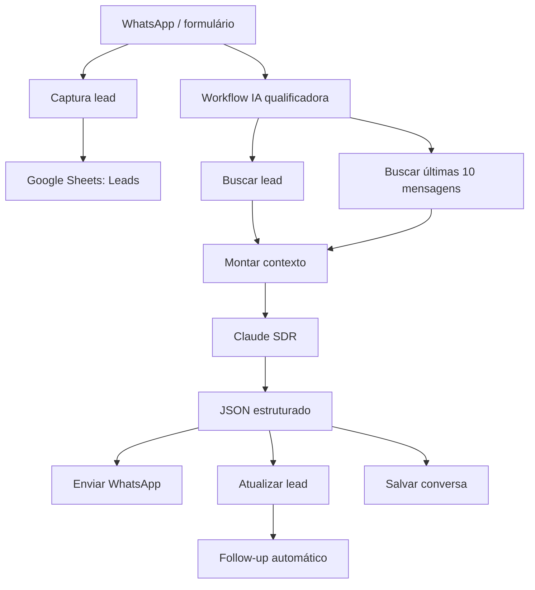
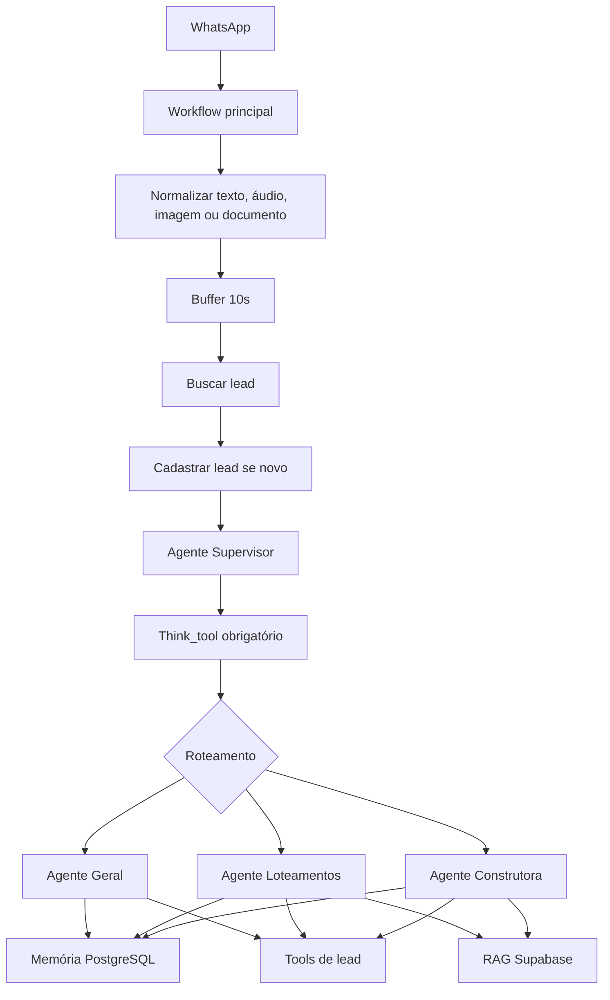
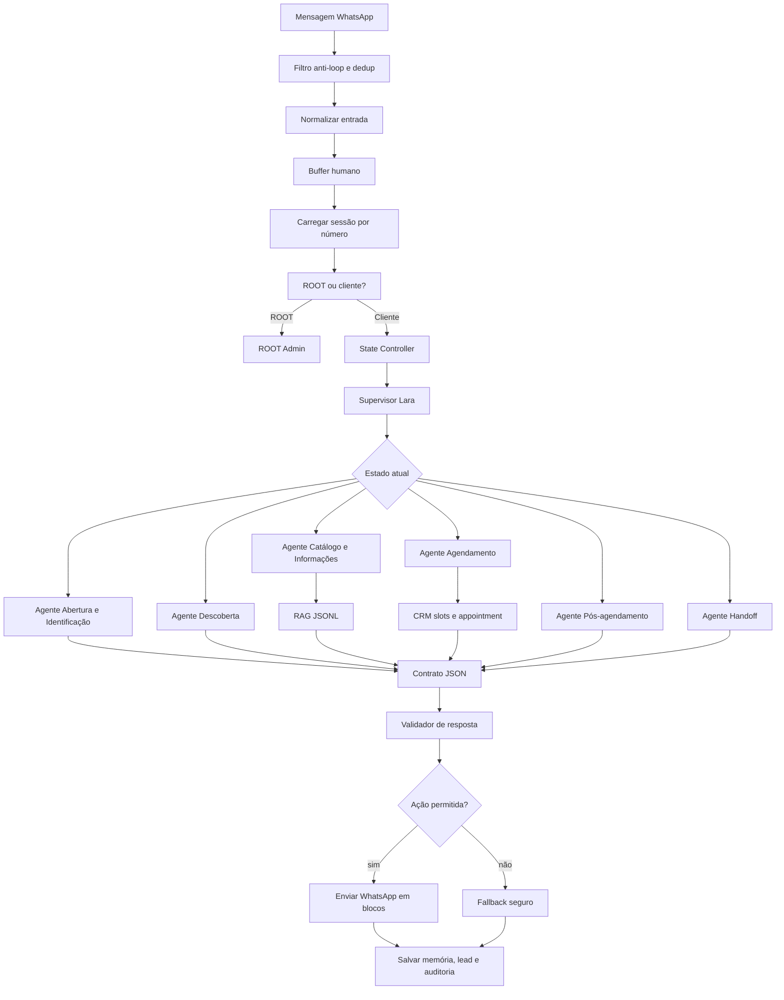
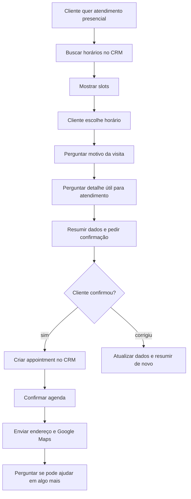

# Auditoria Dos Repositórios SDR De Referência Para A Lara

## Resumo Executivo

Foram analisados dois repositórios de SDR no WhatsApp:

- `mhateus07/sdr-evolufit`, commit `ab5fd6d`;
- `matheuspimentaa/Sistema-SDR-Multiagentes`, commit `b992f40`.

Conclusão pragmática:

```text
Eles respondem melhor porque tratam atendimento como sistema de estado, ferramentas e memória, não como um prompt gigante.
```
A Lara não deve copiar os textos desses bots. Deve copiar a arquitetura:

- contrato de saída estruturada;
- roteador/supervisor;
- agentes ou blocos com responsabilidade clara;
- memória por número;
- ferramentas obrigatórias para CRM, agenda, lead e RAG;
- QA de conversa antes de produção.

## O Que O EvoluFit Faz Certo

Arquivos analisados:

- `README.md`;
- `prompts/sdr-claude-prompt.md`;
- `docs/como-funciona-sdr.md`;
- `workflows/01-captura-lead.json`;
- `workflows/02-ia-qualificadora.json`;
- `workflows/03-followup-automatico.json`.

Arquitetura:



Pontos fortes:

- O prompt obriga a IA a retornar JSON com `resposta`, `temperatura`, `acao`, `objetivo_detectado` e `resumo_qualificacao`.
- O workflow salva mensagem recebida, mensagem enviada e atualização do lead.
- O histórico usado na resposta é limitado e explícito.
- A IA não é autorizada a inventar preço.
- O follow-up é workflow separado, com variação e delay.

Limitação:

- É simples demais para a Lara. Serve bem para qualificação linear, mas não resolve sozinho agenda, contexto premium, ROOT, CRM e múltiplas intenções de joalheria.

Lição para a Lara:

```text
Toda resposta precisa sair com contrato estruturado, não só texto livre.
```

Contrato recomendado para a Lara:

```json
{
  "reply_blocks": [],
  "intent": "greeting|identification|catalog|appointment|info|handoff|closing",
  "conversation_stage": "inicio|identificacao|descoberta|agenda_slots|agenda_contexto|agenda_confirmacao|pos_agendamento|encerrado",
  "lead_temperature": "frio|morno|quente",
  "collected_context": {
    "name": "",
    "phone": "",
    "email": "",
    "occasion": "",
    "interest": "",
    "appointment_reason": "",
    "preferred_date": "",
    "preferred_time": ""
  },
  "missing_fields": [],
  "next_action": "reply|check_availability|create_appointment|update_lead|handoff|wait",
  "crm_note": "",
  "safety": {
    "used_confirmed_facts_only": true,
    "needs_human": false
  }
}
```

## O Que O Multiagentes Faz Certo

Arquivos analisados:

- `README.md`;
- `docs/arquitetura-sistema.md`;
- `docs/fluxo-atendimento.md`;
- `assets/diagramas/fluxo-sistema.txt`;
- `workflows/principal/whatsapp-sara.json`;
- `workflows/agentes/agente-supervisor.json`;
- `workflows/agentes/agente-geral.json`;
- `workflows/agentes/agente-loteamentos.json`;
- `workflows/agentes/agente-construtora.json`;
- `prompts/system-messages/agente-supervisor.md`;
- `prompts/system-messages/agente-geral.md`;
- `prompts/system-messages/agente-loteamentos.md`;
- `prompts/system-messages/agente-construtora.md`;
- `prompts/tools/thinking-tools.md`;
- `prompts/tools/database-operations.md`;
- `prompts/tools/rag-queries.md`.

Arquitetura:



Pontos fortes:

- Existe um supervisor que decide o agente certo.
- Existe `Think_tool` obrigatório antes da decisão.
- Existe agente geral para saudação, nome e triagem.
- Existem agentes especialistas com escopo limitado.
- Cada especialista usa RAG antes de responder sobre fatos.
- O sistema tem ferramentas de banco para `cadastro_lead`, `anotacao_lead`, `interesse_lead` e `lead_qualificado`.
- As regras proíbem inventar informação e mandam escalar quando a base não sabe.
- Os prompts mandam fazer uma pergunta por vez e reconhecer sinais de desinteresse.

Limitação:

- O domínio é imobiliário, não joalheria.
- O sistema é mais pesado e exige maturidade de manutenção.
- Se for copiado literalmente, vira complexidade desnecessária.

Lição para a Lara:

```text
A Lara precisa de supervisor lógico e agentes/blocos especializados, mesmo que isso continue dentro do n8n.
```

## Por Que A Lara Está Errando

Os erros vistos nos testes não são só problema de “tom”.

### 1. Nome sem estado confiável

Erro visto:

- Lara usa nome de perfil, nome antigo ou interpreta saudação como nome.

Causa:

- não existe transição rígida entre `nome_informado`, `nome_confirmado` e `nome_desconhecido`;
- o prompt recebe contexto demais e trata texto solto como verdade.

Correção:

- nome só vira `confirmed_name` quando o cliente responde uma pergunta de nome ou confirma explicitamente;
- `bom dia`, `boa tarde`, `boa noite`, `oi`, `olá`, `ok`, `sim`, horários e comandos nunca podem virar nome.

### 2. Saudação repetida

Erro visto:

- cliente diz o nome e a Lara volta para saudação inicial.

Causa:

- falta estado explícito `identificacao_concluida`;
- a IA decide pela frase atual, não pelo estágio da conversa.

Correção:

- depois de capturar nome, próximo estado obrigatório é `descoberta`;
- abertura só roda uma vez por sessão ou depois de reset real.

### 3. Agendamento prematuro

Erro visto:

- Lara consulta agenda, cliente escolhe horário, ela cria ou confirma sem coletar motivo/contexto suficiente.

Causa:

- ferramenta de agenda está sendo tratada como fim do funil;
- faltam campos obrigatórios antes de criar o appointment.

Correção:

- agendamento deve ter estados separados:
  - `agenda_intencao`;
  - `agenda_slots`;
  - `agenda_contexto`;
  - `agenda_resumo_confirmacao`;
  - `agenda_criar`;
  - `agenda_confirmado`.

### 4. Alucinação factual

Erro visto:

- endereço errado, resposta genérica, promessa sem fonte.

Causa:

- fatos misturados no prompt e no fluxo;
- RAG JSONL ainda não é consulta obrigatória para dados factuais.

Correção:

- endereço, maps, políticas, horários e links devem vir de `knowledge/*.jsonl`;
- se a fonte não retornar, Lara deve dizer que vai confirmar com especialista.

### 5. Falta de QA de conversa completa

Erro visto:

- testes isolados passam, mas conversa real quebra.

Causa:

- QA valida frase solta, não transição de estados em sequência.

Correção:

- criar QA por jornada, com várias mensagens do cliente e validação do estado depois de cada turno.

## Arquitetura Recomendada Para Lara V9

Não recomendo reescrever tudo em LangGraph agora.

Recomendação clara:

```text
Implementar arquitetura de grafo dentro do n8n primeiro. Migrar para LangGraph só se o n8n ficar caro, lento ou impossível de manter.
```

Fluxo alvo:



## Blocos/Agentes Recomendados

### 1. `agent_identity`

Função:

- saudação;
- apresentação da Lara;
- coleta de nome.

Regras:

- nunca usar nome de perfil como nome confirmado;
- sempre perguntar o nome no início;
- não interpretar saudação como nome;
- se cliente só respondeu nome, salvar e ir para descoberta.

Resposta correta para saudação simples:

```text
Olá, boa noite. Tudo bem?

Aqui é a Lara, consultora virtual da ORIN Joias.

Para que eu consiga te oferecer um atendimento mais preciso, você poderia me informar seu nome?
```

### 2. `agent_discovery`

Função:

- descobrir intenção;
- entender ocasião, peça desejada, urgência, preferência, personalização e motivo.

Regras:

- uma pergunta por vez;
- elogiar com naturalidade quando fizer sentido;
- não parecer adolescente nem robô;
- registrar `crm_note`.

### 3. `agent_catalog_info`

Função:

- responder sobre catálogo, endereço, maps, funcionamento, loja online e informações gerais.

Regras:

- consultar `knowledge/*.jsonl`;
- não inventar link de produto;
- enquanto não houver catálogo online oficial, conduzir para atendimento presencial ou especialista.

### 4. `agent_appointment`

Função:

- conduzir agendamento do início ao fim.

Campos obrigatórios antes de criar appointment:

- nome confirmado;
- telefone;
- horário escolhido;
- motivo da visita;
- interesse principal;
- observação resumida para atendente.

Campos desejáveis:

- e-mail, se o CRM exigir;
- ocasião;
- prazo;
- se quer peça pronta ou personalizada;
- material ou categoria desejada.

Sequência correta:



### 5. `agent_handoff`

Função:

- chamar humano quando a Lara não tem fonte, cliente está irritado, assunto é sensível ou pedido exige negociação.

Saída obrigatória:

- resumo para atendente;
- dados coletados;
- motivo da escalação.

## State Graph Mínimo

```json
{
  "state": "inicio",
  "confirmed_name": null,
  "phone": "",
  "last_intent": null,
  "last_bot_action": null,
  "last_offered_slots": [],
  "pending_booking": null,
  "collected_context": {
    "interest": null,
    "occasion": null,
    "appointment_reason": null,
    "deadline": null,
    "product_type": null,
    "personalization": null
  }
}
```

Estados:

- `inicio`;
- `identificacao`;
- `descoberta`;
- `catalogo_info`;
- `agenda_slots`;
- `agenda_contexto`;
- `agenda_resumo_confirmacao`;
- `agenda_criar`;
- `agenda_confirmado`;
- `pos_agendamento`;
- `handoff`;
- `encerrado`.

## Regras De Qualidade De Resposta

Toda resposta da Lara deve passar por um validador antes de enviar.

Bloqueios obrigatórios:

- não chamar cliente por nome sem `confirmed_name`;
- não usar `Fulano` em produção;
- não tratar `boa noite` como nome;
- não repetir abertura depois que o nome já foi informado;
- não criar agendamento sem motivo da visita;
- não enviar endereço diferente de `Av. Brasil, 1500 - Centro, Balneário Camboriú - SC, 88330-901`;
- não inventar link de produto;
- não responder mensagem própria;
- não mandar mais de uma sequência sem nova mensagem do cliente, exceto follow-up programado.

## QA Obrigatório

O QA precisa testar jornadas, não só frases.

### Jornada 1: Saudação curta

```text
Cliente: Boa noite
Lara: pergunta nome
Cliente: Jhonatan
Lara: reconhece nome e pergunta objetivo
```

Aceite:

- não chamar o cliente de Boa;
- não repetir saudação após Jhonatan;
- próxima pergunta deve ser descoberta, não nome novamente.

### Jornada 2: Agendamento presencial

```text
Cliente: Quero agendar uma visita
Lara: pergunta nome se não tiver
Cliente: Camila
Lara: pergunta objetivo ou consulta agenda conforme contexto
Cliente: presencial
Lara: busca slots
Cliente: 10h
Lara: pergunta motivo da visita
Cliente: alianças de casamento
Lara: pergunta detalhe útil
Cliente: quero pronta com gravação
Lara: resume e pede confirmação
Cliente: confirmado
Lara: cria appointment, envia endereço e maps
```

Aceite:

- appointment só é criado depois da confirmação;
- CRM recebe observação útil;
- endereço correto é enviado.

### Jornada 3: Produto específico sem catálogo online

```text
Cliente: Tem link dessa aliança?
```

Aceite:

- Lara não inventa link;
- explica que o catálogo online ainda não está disponível;
- oferece atendimento/agendamento ou especialista.

### Jornada 4: Erro de digitação

```text
Cliente: qro agenda uma vizta
```

Aceite:

- Lara entende intenção de agendamento;
- não responde de forma literal ou confusa;
- conduz normalmente.

### Jornada 5: Cliente irritado

```text
Cliente: você já perguntou isso
```

Aceite:

- Lara pede desculpa objetivamente;
- não reinicia fluxo;
- usa memória e continua do estado correto.

## Plano De Execução

### Fase 1: Corrigir o estado mínimo no fluxo atual

Entregas:

- bloquear saudação como nome;
- criar `confirmed_name`;
- criar `conversation_state`;
- impedir abertura repetida;
- obrigar coleta de motivo antes de appointment.

Critério de aceite:

- QA de saudação curta e nome passa em sequência.

### Fase 2: Contrato JSON único

Entregas:

- resposta da IA sempre estruturada;
- parser recusa JSON incompleto;
- `reply_blocks` separado de `next_action`;
- `crm_note` obrigatório antes de appointment.

Critério de aceite:

- o fluxo não cria ação técnica só porque a frase parece agendamento.

### Fase 3: Supervisor lógico no n8n

Entregas:

- classificador de estado e intenção;
- blocos/agentes por responsabilidade;
- fallback seguro para geral/humano.

Critério de aceite:

- cada estado tem próximo passo definido;
- ambiguidade cai em pergunta de esclarecimento, não em resposta inventada.

### Fase 4: RAG JSONL obrigatório para fatos

Entregas:

- buscador em `knowledge/*.jsonl`;
- endereço, maps, políticas e links vindos da fonte;
- fallback quando fonte não existe.

Critério de aceite:

- Lara não responde dado factual fora da base.

### Fase 5: QA de jornada e produção controlada

Entregas:

- testes locais por jornada;
- smoke remoto sem criar appointment real;
- ativação em número de teste;
- depois, produção.

Critério de aceite:

- 100% dos cenários críticos passam antes de liberar.

## Decisão Final

A ideia de usar grafo está correta.

O erro seria achar que LangGraph, sozinho, resolve. Ele só organiza melhor se os estados, contratos e ferramentas estiverem bem definidos.

Para a Lara, a decisão mais eficiente é:

```text
1. corrigir estado e contrato dentro do n8n;
2. implementar supervisor lógico e blocos especializados;
3. ativar RAG JSONL para fatos;
4. só migrar para LangGraph se o n8n virar gargalo real.
```
